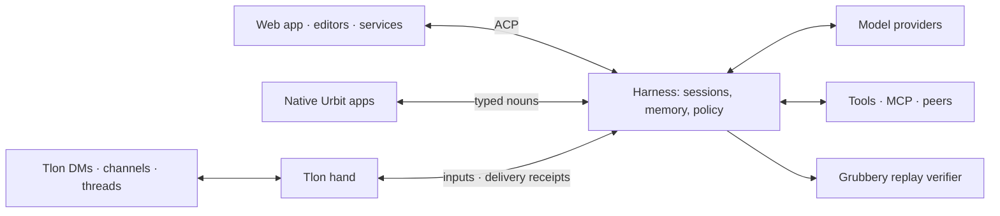

# Urbit Agent Harness

Harness runs AI agents on your Urbit ship. Talk to them in the web app, Tlon,
or a connected editor. They can research, use tools, work with other agents,
and schedule follow-ups.

Your ship keeps the conversations, permissions, and work. You can switch clients
or models without moving your history, and closing the browser doesn't stop
work that's underway.

## How it fits together

The **head** runs conversations and keeps their history on the ship. **Hands**
connect conversations to apps such as Tlon and track whether replies are sent.
Model providers supply inference; tools give agents access to other services.



Conversations have separate tool permissions and can work concurrently while
waiting on models and services. They share the ship's event loop.

## Capabilities

- Choose models from OpenRouter, OpenAI, Anthropic, or a compatible endpoint.
- Search conversation history and pin notes that survive summarization.
- Give agents web access, ship files, reusable skills, and tools from MCP servers.
- Delegate work to local agents or mutually trusted ships.
- Use Tlon conversations, groups, Notes, and publishing.
- Schedule one-time follow-ups, recurring work, and reminders.
- Keep track of tasks and projects, and review or publish documents in **Work**.

Default tools have broad access, including HTTP, ship files, skill authoring,
and Tlon. Review permissions before connecting other people or agents.
JavaScript execution is opt-in and is not sandboxed by other tool permissions.
Tlon features and document storage need Groups; ordinary conversations do not.
Models run through configured providers, not on the ship itself.

See the [capability guide](docs-refs/capabilities.md) for scope and limits, or
[companion workflows](docs-refs/companion.md) for practical uses.

## Build and install

Create and mount a desk in Dojo:

```text
|new-desk %harness
|mount %harness
```

Assemble into the mount:

```sh
zig build -Ddesk=/path/to/pier/harness
```

Commit and install in Dojo:

```text
|commit %harness
|install our %harness
```

Open `/apps/harness`. In Settings, configure a provider and model, review default
tools and start a conversation. To enable Tlon replies, open Tlon in the sidebar,
select an owner and trusted ships, review their grants, then enable the hand.
Unpermissioned senders are silently ignored.

Full-desk assembly removes files absent from its output. For an existing
development mount, build to `zig-out` and copy only intended overlay changes.
See [development and verification](docs-refs/development.md).

## Using a conversation

Send `/help` for the shared command list. `/status` inspects the conversation,
`/model` selects its model, `/context` reports its working-context budget and
`/compact` summarizes older exchanges. `/stop` cancels active work; it cannot
undo an external action already performed.

Use `/remember preference Keep replies short.` to pin a note,
`/memory` to list notes and `/forget preference` to unpin one.
Notes belong to that conversation and survive compaction verbatim. Search
content finds retained evidence; it does not fetch every other app's history.
See [context and memory](docs-refs/context-and-memory.md).

## Connect an editor or service

Clients can connect directly to the ship's authenticated ACP API. For an editor
that expects a local stdin/stdout executable, use the bridge:

```sh
SHIP_URL=http://localhost:8081 \
SHIP_CODE=your-ship-code \
node acp/harness-acp.mjs
```

Treat the ship login code as an owner credential.
See the [adapter setup](acp/README.md) and [integration guide](docs-refs/integrations.md).

## Documentation

| Read this | For |
| --- | --- |
| [Architecture](docs-refs/architecture.md) | Ownership, lifecycle, source modules and trust boundaries |
| [Capabilities](docs-refs/capabilities.md) | Available features, authority and limits |
| [Companion workflows](docs-refs/companion.md) | Research, social collaboration and scheduled work |
| [Integrations](docs-refs/integrations.md) | Choosing ACP, native nouns, webhooks, MCP or hands |
| [ACP reference](docs-refs/acp.md) | Client methods, commands, authentication and recovery |
| [Conversation hands](docs-refs/hands.md) | Bindings, deduplication, publication receipts and retirement |
| [Shared scheduling](docs-refs/scheduling.md) | Tasks and reminders from any hand; Settings → Schedules |
| [Artifacts and projects](docs-refs/workspaces.md) | Editing, agent coordination, proposal review and public pages |
| [Conversation work management](docs-refs/work-control.md) | Text-first work controls; human confirmation for protected changes |
| [Tlon reference](docs-refs/tlon.md) | Social tools, Notes, hooks, publishing and media |
| [Peers](docs-refs/peers.md) | Ship-to-ship requests, tool RPC and administrative authority |
| [Context and memory](docs-refs/context-and-memory.md) | Summaries, pinned notes, corpus search and provenance |
| [JavaScript execution](docs-refs/execution.md) | Opt-in executor, host APIs and resource limits |
| [Development](docs-refs/development.md) | Build layout, test selection and safe live verification |
| [Reliability](docs-refs/reliability.md) | Sustained local operation, fault recovery, evidence and coverage limits |
