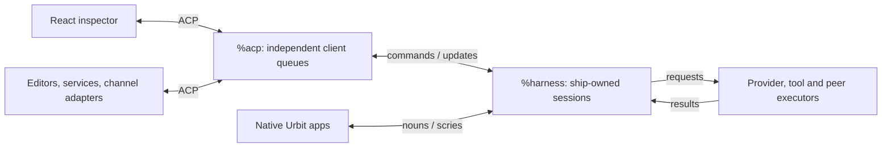
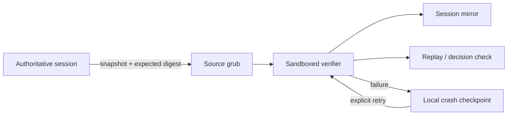

# Urbit Agent Harness

Harness is an Urbit-native durable agent head and effect router. Conversations
are event logs owned by the ship; providers, tools, channels, peers, sandboxes,
and user interfaces are replaceable hands around the same sessions. Native
nouns are the internal contract, and ACP projects that contract to conventional
software—including the included React inspector.

The desk uses Grubbery as a compact application substrate. `%harness-grub`
provides its supervised process and effect services without installing a
pseudo-desktop or a second chat application. Authoritative sessions are
independently replay-checked by sandboxed session verifiers and mirrored into
`/agents/main/sessions` as typed grubs, keeping native consumers independent of
the React inspector. Execution ownership remains with the head.



Clients share the head, not an execution loop. Closing an inspector does not
stop a session; changing a provider does not move its memory. One desk declares
`%harness`, `%acp`, `%harness-grub`, and `%harness-fileserver`.

## What works

- Independent, durable conversations with replay, append-only cancellation,
  fork provenance, retry, compaction, timers, subagents, skills, and peer calls.
- OpenRouter, OpenAI, Anthropic, and custom OpenAI-compatible endpoints, with
  API keys, OpenAI device login, Anthropic browser-login handoff, and arbitrary
  request headers. ChatGPT login uses its Codex Responses endpoint.
- Provider model discovery, automatic published context limits, and free-form
  model entry; a conversation can change provider or model between turns.
- Durable global defaults snapshotted into new conversations, plus a shared
  Streamable HTTP MCP registry whose use remains capability-gated per thread.
- Typed input provenance across ACP, pokes, timers, webhooks, peers, and child
  sessions, with an explicit response route.
- Scryable derived views and chronological event histories for native clients.
- Pure session inspection and branching gates, full revisioned transcripts
  independent of compaction, and client-independent cancellation and resume.
- Execution-time capability checks in addition to provider-visible schemas.
- An ACP React inspector with optimistic message admission, an immediate
  thinking indicator, incremental reply display when the HTTP transport
  exposes provider chunks, Markdown replies with copyable code and scrollable
  tables, live tool updates, rename/delete, responsive
  settings, and system/light/dark themes.
- A dependency-free ACP stdio adapter for editors and other local clients.
- Generic conversation hands over native nouns or ACP: durable bindings,
  deduplicated input queues, and publication claims/receipts independent of
  inference, fair admission limits, fenced owner recovery and explicit archive
  retirement. See [the hand contract](docs-refs/hands.md).
- Per-conversation tools for ship time, Clay, HTTP, skills, authored
  capabilities, subagents, and explicitly granted peers. New conversations
  begin with the full catalog enabled and can narrow it independently.

Native inference and a required Groups installation are outside this desk.
Either can be added behind a typed capability without changing session
ownership.

## Supervised grubs, one authoritative head

The Grubbery verifier independently replays a session snapshot. It can write
only its result namespaces—not call a provider or mutate the head.



Native apps and ACP clients can inspect the check or request a recheck. A
failure waits for intervention without stopping the head or repeating inference.
Full effect-dispatch conformance and independently owned session/run grubs are
the next stages, not claims this checkpoint already proves. See the
[architecture](docs-refs/architecture.md#grubberys-role) and
[Grubbery roadmap](docs-refs/roadmap.md#grubbery-capabilities).

## Build and install

Mount or create a fresh `%harness` desk, then assemble into it:

```sh
zig build -Ddesk=/path/to/pier/harness
```

Commit and install from Dojo:

```text
|commit %harness
|install our %harness
```

Open `/apps/harness`. Agent and provider configuration are tabs in Settings.

For an existing development mount, run `zig build` and copy the changed overlay
files from `desk` instead of synchronizing the entire mount. The full-desk
build removes files absent from its output, including local test dependencies.

The build pins a Grubbery revision, builds the React application, assembles the
minimal runtime, renames its Gall process to `%harness-grub`, and overlays the
Harness code. `zig build clean` removes `zig-out`; `zig build clear` also
removes the dependency checkout.

## ACP adapter

```sh
SHIP_URL=http://localhost:8081 \
SHIP_CODE=your-ship-code \
node acp/harness-acp.mjs
```

The browser is one ACP client. Each client has an independent ordered queue
while all of them address the same on-ship session records. See
[`acp/README.md`](acp/README.md).

## Repository map

```text
build.zig                  reproducible desk assembly
desk/app/harness.hoon      authoritative lifecycle and ingress routing
desk/app/acp.hoon          durable duplex transport
desk/lib/harness.hoon      semantic core: replay, transcript, decide
desk/lib/harness-session.hoon pure session services and budget composition
desk/lib/harness-provider.hoon provider wire formats and model catalogs
desk/lib/harness-json.hoon client projections and command decoding
desk/lib/harness-tools.hoon capability catalog and executor safeguards
desk/lib/harness-effects.hoon concrete effect bindings; no session store
desk/lib/harness-acp.hoon   ACP frames/cards; no session ownership
desk/lib/harness-defaults.hoon bootstrap policy
desk/{sur,lib}/harness-store.hoon persistence envelope and version loading
desk/lib/harness-hand.hoon bindings, admission queue, and delivery receipts
desk/lib/harness-session-nexus.hoon supervised replay verifier
desk/lib/root.hoon         minimal Grubbery service tree
desk/tests/harness.hoon    pure head and response-parser checks
desk/tests/harness-boundaries.hoon storage, codec and authority contracts
scripts/modules.test.mjs   dependency direction and cycle checks
scripts/conformance.mjs    live independent-client/session checks
scripts/hand-conformance.mjs live native/ACP hand and publication checks
scripts/hand-operations-conformance.mjs recovery, archive and verification checks
scripts/shadow-conformance.mjs isolated verifier fault/reload checks
scripts/archive-hand.mjs   durable export before binding retirement
fe/                        componentized React ACP client
acp/harness-acp.mjs        ACP stdio-to-Eyre adapter
acp/hand-client.mjs        transport-independent ACP hand helper
docs-refs/                 design, protocol, and roadmap
```

- [`architecture.md`](docs-refs/architecture.md) explains ownership and
  boundaries.
- [`lightspeed-design.md`](docs-refs/lightspeed-design.md) records the design
  invariants.
- [`a2a-design.md`](docs-refs/a2a-design.md) develops identity and peer work.
- [`acp.md`](docs-refs/acp.md) defines the client boundary.
- [`hands.md`](docs-refs/hands.md) defines bidirectional conversation adapters.
- [`integrations.md`](docs-refs/integrations.md) shows how editors, services,
  on-ship apps, webhooks, peers, timers, and MCP servers connect.
- [`roadmap.md`](docs-refs/roadmap.md) tracks completed and planned work.

The central design claim is that an Urbit event log makes a good long-lived
agent head: deterministic, inspectable, restartable, and independent of any
particular model or client.

Start with `sur/harness.hoon` and `lib/harness.hoon`, then follow
`lib/harness-session.hoon` into the Gall lifecycle. Providers and client
formats are edges, not prerequisites for understanding the reducer. See the
[code boundaries and extension guide](docs-refs/architecture.md#code-boundaries).
Keep modules skimmable—roughly under 2,000 lines is a useful signal, not a
reason to separate code that must uphold one invariant together.

## Verification

```sh
npm test --prefix fe
node --test acp/hand-client.test.mjs
node --test scripts/modules.test.mjs
zig build
SHIP_URL=http://localhost:8081 SHIP_COOKIE=/path/to/auth-cookie.txt \
  node scripts/conformance.mjs
```

The live checks use the ship's configured provider and incur inference usage.
They create uniquely named test sessions and remove those sessions afterward.
`scripts/cancellation-conformance.mjs` uses the same authentication with local
provider/tool fixtures (no inference charges). Run it on the ship's host to
check interruption during tool work, immediate continuation, provider transcript
validity, terminal ACP updates, and duplicate/late-result rejection.
Run `-test /=harness=/tests/harness` in Dojo for pure replay, transcript,
branch-boundary, and provider-parser checks (requires `/lib/test` on the desk).
Run `-test /=harness=/tests/harness-boundaries` for persistence preservation,
shared redacted projections, capability grants, and provider metadata.
Run `-test /=harness=/tests/harness-hand` for binding, deduplication, queue,
and receipt checks. `scripts/hand-conformance.mjs` uses the same ship environment
for real model turns through two hands; publication callbacks are local test
fixtures, never posts to a real channel. Failed runs retain unresolved test
bindings rather than silently discarding their pending publications.
Run `-test /=harness=/tests/harness-shadow` for replay and failure-checkpoint
tests. `scripts/hand-operations-conformance.mjs` uses the same environment for
live owner recovery and archive checks. Test archives remain in printed private
temporary directories; they are not a production archive location.

`SHIP_DOJO_PANE=0:1.1 node scripts/shadow-conformance.mjs` additionally requires
the same ship cookie environment and an idle Dojo tmux pane. It corrupts only a
uniquely named test verifier, reloads the runtime, and verifies explicit ACP
recovery without changing the authoritative conversation.

`npm run test:ui --prefix fe` runs isolated browser checks for Markdown safety,
copying, scrolling, the composer, dialog focus, and mobile/light/dark layouts.
Install the test browser once with `cd fe && npx playwright install chromium`,
or set `PLAYWRIGHT_CHANNEL=chrome` to use an installed Chrome. These tests use
deterministic ACP fixtures, need no ship credentials, and make no model calls.
Fixtures are not included in the production build.
