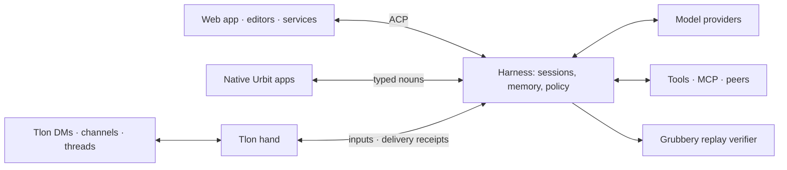

# Urbit Agent Harness

Harness runs AI agents on an Urbit ship. The ship owns their conversations,
memory, permissions and work records; models and interfaces connect to that
durable state. Use the included web app, an editor, a native Urbit app or Tlon
without making any one interface responsible for keeping the agent alive.

A conversation can research, use tools, delegate work, manage Tlon content and
schedule follow-ups. Its provider and model can change between turns without
moving its history. Closing a browser does not stop accepted work.

## How it fits together

The **head** is the on-ship service that records inputs, decides what runs next
and accepts results. **Hands** connect it to conversation surfaces and external
effects. A conversation hand also tracks delivery separately from inference:
a failed send does not require another model turn.



This separation provides:

- Continuity across clients, provider changes and agent reloads.
- Inspectable history, explicit cancellation and branches that do not rerun
  inherited effects.
- Per-conversation permissions, with live checks at tool dispatch and result
  admission.
- Delivery records that distinguish accepted work, completed inference and an
  uncertain external send.
- Native and conventional integration paths around one conversation owner.

Independent sessions can wait on providers and tools concurrently. They share
Urbit's event loop; this is asynchronous progress, not parallel CPU execution.

## Capabilities

- Model providers: OpenRouter, OpenAI, Anthropic and compatible custom endpoints;
  provider credentials, model catalogs and per-conversation settings. OpenAI API
  keys and device login have separate routes and credential slots.
- Memory: source-linked hierarchical summaries, explicit pinned notes, retained
  transcripts and permission-scoped lexical search. Compaction reduces model
  context; it does not delete history.
- Tools: path-scoped Clay reads, web search, general HTTP, shared skills,
  subagents, peer requests and direct remote tool calls. MCP access is granted
  by named server.
- Tlon: DMs and threaded replies, history, reactions, groups, roles, moderation,
  group DMs, Notes, uploads, persistent channel hooks and public publishing.
  The reply hand and the ship-wide Tlon tool are independently configurable.
- Scheduled work: destination-bound UTC cron runs and literal one-shot reminders,
  with separate execution and delivery status.
- Artifacts and projects: Notes-backed Markdown and history, reviewed agent
  proposals, shared documents and atomic task claims. Publish saved snapshots
  through native Notes; unified search groups matching artifact revisions.
- Clients: a React web app, a dependency-free ACP stdio adapter, native
  poke/watch/scry interfaces, webhooks and a durable conversation-hand protocol.

Fresh-install defaults enable broad local capabilities, including general HTTP,
shared skill authoring, ship-wide Tlon tools and Clay reads across desks.
Review and narrow grants before connecting external participants. Saved defaults
and existing conversations retain their explicit settings. JavaScript execution
is opt-in and has broad host authority, not a sandbox enforced by other tool grants.

Groups is needed for Tlon features, not for ordinary Harness conversations.
Model inference uses configured providers; a native model runtime is not bundled.

See the [capability guide](docs-refs/capabilities.md) for scope and limits, or
[companion workflows](docs-refs/companion.md) for practical uses.

## Build and install

Create and mount a desk in Dojo:

```text
|new-desk %harness
|mount %harness
```

Assemble into the mount:

```sh
zig build -Ddesk=/path/to/pier/harness
```

Commit and install in Dojo:

```text
|commit %harness
|install our %harness
```

Open `/apps/harness`. In Settings, configure a provider and model, review default
tools and start a conversation. To enable Tlon replies, open Tlon in the sidebar,
select an owner and trusted ships, review their grants, then enable the hand.
Unpermissioned senders are silently ignored.

Full-desk assembly removes files absent from its output. For an existing
development mount, build to `zig-out` and copy only intended overlay changes.
See [development and verification](docs-refs/development.md).

## Using a conversation

Send `/help` for the shared command list. `/status` inspects the conversation,
`/model` selects its model, `/context` reports its working-context budget and
`/compact` summarizes older exchanges. `/stop` cancels active work; it cannot
undo an external action already performed.

Use `/remember preference Keep replies short.` to pin a note,
`/memory` to list notes and `/forget preference` to unpin one.
Notes belong to that conversation and survive compaction verbatim. Search
content finds retained evidence; it does not fetch every other app's history.
See [context and memory](docs-refs/context-and-memory.md).

## Connect an editor or service

HTTP-capable clients connect directly to the ship's ACP API through authenticated
Eyre. The hand API is the on-ship `harness/hand` method; it needs no local adapter
process. For a client that expects a local stdin/stdout executable, use the
optional bridge:

```sh
SHIP_URL=http://localhost:8081 \
SHIP_CODE=your-ship-code \
node acp/harness-acp.mjs
```

Each ACP client has an independent ordered queue while addressing the same
on-ship sessions. Treat the ship login code as an owner credential.
See the [adapter setup](acp/README.md) and [integration guide](docs-refs/integrations.md).

## Documentation

| Read this | For |
| --- | --- |
| [Architecture](docs-refs/architecture.md) | Ownership, lifecycle, source modules and trust boundaries |
| [Capabilities](docs-refs/capabilities.md) | Available features, authority and limits |
| [Companion workflows](docs-refs/companion.md) | Research, social collaboration and scheduled work |
| [Integrations](docs-refs/integrations.md) | Choosing ACP, native nouns, webhooks, MCP or hands |
| [ACP reference](docs-refs/acp.md) | Client methods, commands, authentication and recovery |
| [Conversation hands](docs-refs/hands.md) | Bindings, deduplication, publication receipts and retirement |
| [Shared scheduling](docs-refs/scheduling.md) | Tasks and reminders from any hand; Settings → Schedules |
| [Artifacts and projects](docs-refs/workspaces.md) | Editing, agent coordination, proposal review and public pages |
| [Tlon reference](docs-refs/tlon.md) | Social tools, Notes, hooks, publishing and media |
| [Peers](docs-refs/peers.md) | Ship-to-ship requests, tool RPC and administrative authority |
| [Context and memory](docs-refs/context-and-memory.md) | Summaries, pinned notes, corpus search and provenance |
| [JavaScript execution](docs-refs/execution.md) | Opt-in executor, host APIs and resource limits |
| [Development](docs-refs/development.md) | Build layout, test selection and safe live verification |
