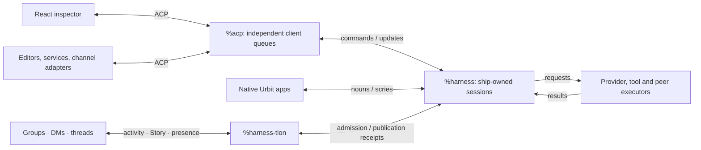
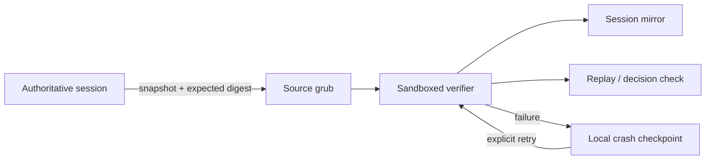

# Urbit Agent Harness

Harness is an Urbit-native durable agent head and effect router. Conversations
are event logs owned by the ship; providers, tools, channels, peers, sandboxes,
and user interfaces are replaceable hands around the same sessions. Native
nouns are the internal contract, and ACP projects that contract to conventional
software—including the included React inspector.

The desk uses Grubbery as a compact application substrate. `%harness-grub`
provides its supervised process and effect services without installing a
pseudo-desktop or a second chat application. Authoritative sessions are
independently replay-checked by sandboxed session verifiers and mirrored into
`/agents/main/sessions` as typed grubs, keeping native consumers independent of
the React inspector. Execution ownership remains with the head.



Clients share the head, not an execution loop. Closing an inspector does not
stop a session; changing a provider does not move its memory. One desk declares
`%harness`, `%acp`, `%harness-grub`, `%harness-fileserver`, and the optional
`%harness-tlon` hand. Configure its owner and per-ship tool grants through the
**Tlon** sidebar button or ACP. The same page edits the ship's public nickname
and avatar in Contacts and applies model defaults to existing conversations.
New conversations snapshot defaults; changing settings never silently retries
failed work. See [Tlon integration](docs-refs/tlon.md).

## What works

- Always-available `current_time`: the ship's UTC clock, Unix seconds and weekday,
  with no permission setting. Other tools retain their resource grants.
- Independent, durable conversations with replay, append-only cancellation,
  fork provenance, retry, compaction, timers, subagents, skills, and peer calls.
- OpenRouter, OpenAI, Anthropic, and custom OpenAI-compatible endpoints, with
  API keys, OpenAI device login, Anthropic browser-login handoff, and arbitrary
  request headers. ChatGPT login uses its Codex Responses endpoint.
  Built-in provider routes follow the selected authentication method; only
  Custom exposes an editable endpoint. OpenAI API and device credentials are
  stored separately, and completing device login also saves its matching route.
  OpenAI device tokens renew on use on the ship; concurrent requests share renewal
  without depending on an open browser.
- Provider model discovery, automatic published context limits, and free-form
  model entry; a conversation can change provider or model between turns.
- Durable global defaults snapshotted into new conversations, plus a shared
  Streamable HTTP MCP registry with per-server conversation grants. Bots discover
  only their granted, enabled servers with `list_mcp_servers`, then inspect and
  call any tool on those servers. Registration does not grant access; select
  individual servers in default, conversation or trusted-Tlon tool settings.
- Web-capable conversations use `web_search` with Brave or SearXNG. Select the
  provider under Settings → Search, then supply a Brave key or SearXNG instance
  base URL. Switching providers preserves the Brave key. SearXNG must enable
  `json` in `search.formats`; see its [Search API documentation](https://docs.searxng.org/dev/search_api.html).
- Typed input provenance across ACP, pokes, timers, webhooks, peers, and child
  sessions, with an explicit response route.
- Scryable derived views and chronological event histories for native clients.
- Pure session inspection and branching gates, full revisioned transcripts
  independent of compaction, and client-independent cancellation and resume.
- Execution-time capability checks in addition to provider-visible schemas.
- An ACP React inspector with optimistic message admission, an immediate
  thinking indicator, incremental reply display when the HTTP transport
  exposes provider chunks, Markdown replies with copyable code and scrollable
  tables, live tool updates, rename/delete, responsive
  settings, and system/light/dark themes.
- A dependency-free ACP stdio adapter for editors and other local clients.
- Generic conversation hands over native nouns or ACP: durable bindings,
  deduplicated input queues, and publication claims/receipts independent of
  inference, fair admission limits, fenced owner recovery and explicit archive
  retirement. See [the hand contract](docs-refs/hands.md).
- Native Tlon images, history, reactions and UTC cron in authorized conversations, without
  per-tool switches. Schedules have bounded runs, cancellation, finished-record
  cleanup and separate execution/delivery status.
  [Image uploads](docs-refs/tlon.md#images-and-storage) run natively on the ship,
  using its existing custom S3 or hosted presigned-URL storage; no extra service.
- A default-enabled `tlon` tool for sending to other DMs/channels, browsing contacts
  and groups, creating groups/channels, invitations and joining/leaving groups.
  Unpermissioned senders get a fixed, rate-limited notice without inference.
- Per-conversation tools for path-scoped Clay reads, HTTP, skills, subagents, explicitly granted
  peers, and experimental skill authoring. Fresh-install defaults enable all
  standard local families, including broad Clay reads and general HTTP.
  MCP servers still need named grants. Saved defaults and existing conversation
  grants are preserved; remote and delegated authority remains scoped.
- Optional **Run JavaScript** runs `run_js` through the original
  QuickJS/WASM and Spider executor. Enable it in a conversation's tool settings;
  it is off by default. It has broad host APIs, including file writes and network
  access, and is not sandboxed by other tool grants. The watchdog stops yielding
  waits, not pure computation. See [execution limits](docs-refs/threads-substrate-notes.md).

Native inference and a required Groups installation are outside this desk.
Either can be added behind a typed capability without changing session
ownership.

## Supervised grubs, one authoritative head

The Grubbery verifier independently replays a session snapshot. It can write
only its result namespaces—not call a provider or mutate the head.



Native apps and ACP clients can inspect the check or request a recheck. A
failure waits for intervention without stopping the head or repeating inference.
Full effect-dispatch conformance and independently owned session/run grubs are
the next stages, not claims this checkpoint already proves. See the
[architecture](docs-refs/architecture.md#grubberys-role) and
[Grubbery roadmap](docs-refs/roadmap.md#grubbery-capabilities).

## Build and install

In any conversation, send `/help` for commands: `/status`, `/context`, `/compact`, `/model`,
`/model <id>`, `/model default`, `/memory`, `/remember <name> <text>`, `/forget <name>`,
and `/stop`. They work through React, ACP and
Tlon hands. Only `/compact` calls a model, to summarize older exchanges without
deleting the transcript. See [command semantics](docs-refs/acp.md#conversation-commands).

Context compacts automatically when the estimated request exceeds the active
model's input budget: its context window minus output headroom and an estimation
margin. There is no fixed working-context cap; changing models changes the
budget. Explicit conversation notes survive compaction verbatim, bounded to
16 notes and 8 KiB including names. Summaries form a source-linked hierarchy;
**Search content** searches the retained corpus across conversations and hands.
Settings → **Memory** optionally selects separate compaction and LCM models;
unset overrides follow the current global default. Model recall is local unless
an owner conversation explicitly grants cross-conversation access. There is no
background fact extraction. Full transcript storage continues to grow; see
[context and memory](docs-refs/context-and-memory.md).

For a first installation, create and mount the desk in Dojo:

```text
|new-desk %harness
|mount %harness
```

Then assemble into that mount:

```sh
zig build -Ddesk=/path/to/pier/harness
```

Commit and install from Dojo:

```text
|commit %harness
|install our %harness
```

Open `/apps/harness`. Agent and provider configuration are tabs in Settings.

For an existing development mount, run `zig build` and copy the changed overlay
files from `desk` instead of synchronizing the entire mount. The full-desk
build removes files absent from its output, including local test dependencies.

The build pins a Grubbery revision, builds the React application, assembles the
minimal runtime, renames its Gall process to `%harness-grub`, and overlays the
Harness code. `zig build clean` removes `zig-out`; `zig build clear` also
removes the dependency checkout.

## ACP adapter

```sh
SHIP_URL=http://localhost:8081 \
SHIP_CODE=your-ship-code \
node acp/harness-acp.mjs
```

The browser is one ACP client. Each client has an independent ordered queue
while all of them address the same on-ship session records. See
[`acp/README.md`](acp/README.md).

## Verification

On a development desk, run `-test /=harness=/tests` for the unit suite.
Full-agent reload, endpoint fixtures, and the 32K-document benchmark live in
`tests-integration`; run those
one file at a time, for example
`-test /=harness=/tests-integration/harness-reload`. They use virtualized agent
evaluation and can be slow and memory-intensive on the default 2 GB loom.
Pure policy, migration, and media checks remain in the default suite.

```sh
npm test --prefix fe
node --test acp/hand-client.test.mjs
node --test scripts/modules.test.mjs
zig build
node --test scripts/distribution.test.mjs
SHIP_URL=http://localhost:8081 SHIP_COOKIE=/path/to/auth-cookie.txt \
  node scripts/conformance.mjs
```

For read-only timings through the actual browser transport (including idle
request counts), run `scripts/performance-read-benchmark.mjs` with `SHIP_URL`
and `SHIP_COOKIE`. Optional `BENCH_BASE=<git revision>` compares that revision's
client with the worktree, in both execution orders. It sends no model prompts
or configuration writes and closes its temporary ACP connections. Run it while
the ship is idle, separately from full-agent compilation tests.
