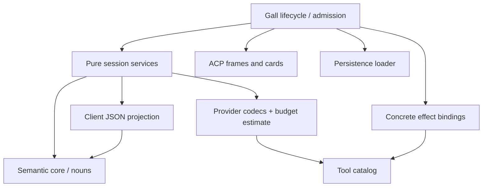
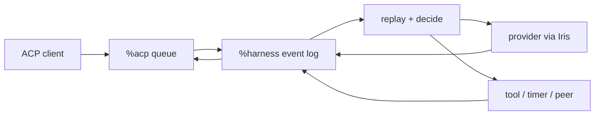

# Architecture

Harness has one authoritative conversation service and multiple ways to use it.
The ship stores accepted inputs, configuration, tool requests, results and
answers. A model provider produces responses; a client displays and controls
work; neither owns the conversation.

The **head** is `%harness`: it admits work, replays session history, decides the
next step and accepts results. **Hands** are adapters at its boundaries.
A conversation hand connects an external surface to an input queue and
publication ledger. Provider and tool executors use their own dispatch paths;
a single generic effect-run protocol is not the execution boundary.

## Mental model

| Concept | Meaning |
| --- | --- |
| Session | Durable event log plus request identity; independent conversation state |
| View | State derived by replaying that log |
| Model context | Selected instructions, notes, summaries, recent exchanges and tool schemas |
| Client connection | Transport queue and subscriptions, not the session itself |
| Binding | Authorized route from a surface and actors to a session |
| Publication | A terminal answer awaiting external delivery, tracked independently of inference |
| Grant | Permission to use a tool family or named resource |
| Receipt | Evidence of a particular result or delivery attempt, not universal proof of remote completion |

One history supports several views: a human transcript, bounded provider input,
a search index and replay checks. The separation keeps continuity independent
of browser lifetime and makes execution and delivery failures inspectable.

## Desk shape

One `%harness` desk declares five Gall agents:

| Agent | Responsibility |
|---|---|
| `%harness` | Session logs, replay, decisions, provider requests, tools, policy |
| `%acp` | Durable, ordered, per-client duplex JSON-RPC queues |
| `%harness-grub` | Minimal Grubbery process/effect runtime |
| `%harness-fileserver` | Authenticated static React application |
| `%harness-tlon` | Optional Groups/DM hand: actor grants, routing, Story delivery |

`desk/lib/root.hoon` loads only the Grubbery services needed for Fibers and
effects: Eyre, Iris, Behn, Clay, and scry. It does not seed a desktop, example
applications, or a competing agent tree.
Runtime startup retains its code/Clay watch, process clock, HTTP bindings and
recovery of explicitly opened Gall/Lick resources. It does not initialize terminal,
keyring, peer-directory or browser-push services, or implicitly mirror `%base`.

## Code boundaries

The **semantic core** is `sur/harness.hoon` plus `lib/harness.hoon`: vocabulary,
replay, transcript, cancellation, continuation and loop guards. The reducer
has no JSON, provider, credential or Gall dependency. Its budget argument is a
pure gate returning an estimate, evaluated only when inference could run.
Idle sessions and in-flight tools therefore do not pay for request encoding.

`outcome` classifies a settled turn as a reply, failure or cancellation. It
returns no outcome while effects are outstanding. ACP, conversation hands,
subagents and peer asks all use this gate; they choose delivery format and
diagnostic visibility, not completion semantics. A config edit does not clear
cancellation. Both completion and cancellation run the same settlement path,
so cancelling a child answers its parent's waiting tool instead of stranding it.
An empty assistant reply is valid; absence of a final reply is not success.

`harness-session` composes those semantics with the provider boundary's request
byte estimate and client snapshot projection. This is a pure service boundary,
shared by Gall and the supervised verifier, not another execution owner.

The arrows below mean **code dependencies**, not message delivery:



Supporting modules have narrow responsibilities:

| Module | Owns | Does not own |
|---|---|---|
| `harness-provider` | Request/response formats, streaming parse, model metadata | Credentials, accepted results, scheduling |
| `harness-json` | Client projections and command decoding | Persisted state or provider wire formats |
| `harness-tools` | Schemas, function-to-family grants, executor safeguards | Tool execution |
| `harness-effects` | Concrete ship reads and HTTP/MCP/timer/peer cards | Session store or continuation |
| `harness-curl` | General HTTP schema, validated request cards and bounded response rendering | Grants, credentials, retry ownership or session state |
| `harness-acp` | ACP frames, terminal updates and transport cards | Prompt ownership or admission |
| `harness-defaults` | Bootstrap instructions and policy | Existing conversation configuration |
| `harness-lcm` / `harness-lcm-context` | Immutable summary forest, addressed planning and validation | Provider dispatch or credentials |
| `harness-corpus` / `harness-corpus-index` | Disposable incremental source projection and segmented lexical index | New input, external-app reads or inference |
| `harness-corpus-json` | Authorized search/read/expansion projections | Authority decisions or scheduling |
| `sur/harness-store` / `lib/harness-store` | Saved-state envelopes and loading | The running decision loop |

Gall keeps admission, authorization, request identities, event appends and
settlement together because its state and emitted cards commit in one event.
The effect door receives only the bowl and MCP registry; the ACP door receives
only our ship identity. Neither receives the session store. These are trusted
code boundaries, not substitutes for the Grubbery weirs that sandbox processes.
Persistence loading is separate from the running decision loop.

To extend Harness, choose the boundary before adding a special case:

- **A provider/protocol:** change codecs and execution-time credential routing;
  return the same Harness result nouns, without changing replay.
- **A tool:** add its catalog/grant mapping and concrete binding; retain the
  head's execution-time authorization and intent-before-dispatch ordering.
- **A client or chat surface:** use ACP or native nouns; do not add a scheduler.
- **A policy:** change defaults or session configuration, not saved history.
- **A new lifecycle meaning:** change the noun vocabulary, reducer and tests
  together; that is a core change, not an adapter convenience.

In React, `acp.js` owns transport, `api.js` maps resource queries/commands,
`useSession` owns the replaceable live view, and `useResource` polls settings.
Resource keys are ACP lookup keys, not Grubbery roads. A resource generation
fences responses from a closed view or reads begun before an acknowledged
save. UI bootstrap defaults live separately from the transport facade and
never overwrite ship-owned policy merely because a component mounts.

## Session ownership

A session is `[log next-req]`. Its closed event vocabulary includes sourced
input, configuration, provider requests and results, tool requests and results,
compaction, cancellation, fork ancestry, retry, and halt. `play` folds the log
into a derived view; `decide` selects the next step; Gall emits effects and
records their results. Earlier session events are never removed to manufacture
a new state: cancellation appends what it abandoned, and a fork appends its
parent and divergence count.



Every new input has a durable identifier, source, actor when known, admission
time, and reply target. ACP, direct pokes, timers, webhooks, peers, subagents,
and rehearsals enter through this envelope. Admission is fast because a prompt
becomes an event before inference begins.
Each session advances independently, so one slow provider call does not block
another conversation. A cancellation records a terminal event and stale
responses are ignored by request identity.

Cancellation also closes every unfinished tool exchange with a derived
cancellation receipt, retaining any results already accepted. Replay, ACP,
and snapshots project these receipts from the cancellation event; the log is
not rewritten. New input therefore reaches the provider after a complete tool
exchange and does not redispatch interrupted calls. A stopped session stays
stopped through configuration changes until new input or an explicit retry.
Outstanding HTTP waits are withdrawn locally; cancellation cannot promise
that an external action was rolled back or never happened.

Native consumers can scry either a derived session view or its chronological
event projection. Subscriptions deliver typed `%harness-update` facts; clients
that understand Harness nouns do not have to pass through ACP or React.

The semantic transcript remains on ship; model requests use a selected context
view. Budget checks and compaction reduce request size without deleting source
events. Estimates are not exact tokenization, and an indivisible oversized
exchange can fail locally. See [context and memory](context-and-memory.md).

`lib/harness-session.hoon` exposes pure `next`, `inspect`, `snapshot`, and `branch`
gates. `inspect` returns the revision, replayed view, and next decision; it
does not execute the decision. `snapshot` derives the complete transcript
directly from events, independent of compaction. Entries carry their one-based
event count and, for sourced input, its durable input identity. Replay collects
items by prepending and reverses once, avoiding repeated prefix copying.

`branch` accepts an event count ending at a completed, tool-free assistant
reply. The child shares the immutable log tail and appends provenance; it does
not rerun inherited effects. Unfinished tool exchanges and invalid boundaries
are rejected. Gall's `%fork-at` action and ACP's `harness/session/fork` call use
this same gate. The gates are a reusable head boundary, not a second scheduler.

## Grubbery's role

Grubbery provides supervised processes and constrained resource access.
Its vocabulary describes the runtime:

- Fibers describe asynchronous programs.
- Darts name effects outside deterministic state.
- Roads address resources.
- Weirs constrain the roads a capability can reach.
- Child processes isolate work and make failure inspectable.

Harness uses this runtime for session mirrors and separate replay verification.
Optional process-based adapters can use its supervision and resource boundaries
without becoming conversation owners.

Every Gall session has a supervised verifier delegated by the root nexus to
`lib/harness-session-nexus.hoon`. The head publishes a source noun under
`/agents/main/shadow-inputs/<session>` containing the session, visible skills
and expected replay/decision digest. A separate Fiber runs the same pure
`harness-session` gates, writes the session mirror under
`/agents/main/sessions/<session>`, and records its check under
`/agents/main/checks/<session>`.

The source and outputs are separate grubs: a verifier cannot rewrite the
authoritative log. Its weir permits only writes to the two result directories,
with no cross-grub reads, service pokes or raw Gall syscalls. Snapshot writes
are idempotent, identified by destination and content; they require neither
entropy requests nor read-before-write exchanges. The Fiber remains waiting
after its check instead of completing and deleting its source grub.

On a failure it checkpoints `[%failed source trace]` in its own noun grub and
waits for an explicit retry. Recording the failure requires no extra
capability, so a denied output write cannot cause a crash-report retry loop.
The checkpoint survives process reconstruction and root reload. Valid source
replacement restarts the check; an owner can also poke the source to retry it.

ACP `harness/session/verify` (with `sessionId`) and native
`/x/verification/<session>` return the authoritative revision and latest check.
Require `matched: true`, equal revisions, and `check.actual` equal to
`authoritativeDigest`; the latter also checks decisions against currently
visible skills, which can change independently of the session revision. A null
or stale check is not evidence about the current head. A crashed check includes a trace digest, not
potentially sensitive diagnostic text. The full source/trace is owner-readable
in its grub. Outputs are JSON-shaped nouns with a total `%noun` storage mark;
the inspector validates locally so malformed diagnostics cannot fail an ACP
update. ACP `harness/session/recheck` republishes the current authoritative
source without adding a semantic event or running inference.

This is a separately executed replay/current-decision checkpoint, **not a second
executor** and not proof that every actual dispatched effect was correct.
It uses the same reducer, so agreement is not an independent semantic oracle.
Snapshots can include an already-pending effect, so the next decision can
be empty. The check does not compare the full dispatched intent/receipt sequence.
`%harness` remains authoritative; native apps and ACP clients share its head.

## Providers

Agent defaults and session configuration are data:

```text
endpoint, model, headers, system instructions,
context budget, enabled tool families
```

Known endpoints select a provider credential held outside the session log;
arbitrary headers support compatible gateways. OpenRouter, OpenAI API keys,
Anthropic and custom endpoints use the OpenAI Chat Completions shape.
OpenAI device login uses the ChatGPT Codex Responses shape and its streamed
event envelope behind the same session boundary. API and device credentials
are separate; device tokens renew on use on the ship. See
[authentication](acp.md#provider-authentication).

New conversations snapshot the durable agent defaults and may then diverge.
Model catalogs are fetched by Iris and returned through the requesting ACP
connection. When a provider publishes context-window metadata, selecting that
model updates the session budget automatically. Catalog failure or absent
metadata never prevents a manually entered model name.

The [context and memory service](context-and-memory.md) separates authoritative
history from model context and the derived lexical corpus index. Hierarchical
compaction uses frozen source plans, separately selected summary models,
accounted usage and shared `/context` and `/compact` commands. Corpus scope
identities survive renaming, and bounded reads expand summaries back to evidence.
Compaction does not bound full-log replay.

## Tools and authority

Tool families are granted per conversation. Fresh-install defaults enable all
standard local families, including broad Clay reads, general HTTP, shared
skill writing, authoring, subagents, peers and corpus recall. MCP servers still
need named grants. The ship-wide Tlon family is included in bootstrap defaults;
destination-scoped Tlon tools derive from live hands. New owner Tlon conversations
inherit configured defaults too. Saved defaults and existing conversations keep
their explicit grants; changing bootstrap policy never rewrites their history.
Remote, scheduled, delegated, and rehearsal
sessions receive purpose-built grants. Provider-visible schemas
are discovery only: execution resolves every function name to a family and
checks the current grant again; internal self-pokes must also correspond to a
durable outstanding call.

The experimental `%code` family is discoverable but excluded from bootstrap
defaults. Its `run_js` tool uses the QuickJS/WASM Spider executor.
It exposes broad host APIs rather than inheriting Clay, network or Tlon tool
scopes. Tlon conversations may use an explicit grant, subject to the live
sender-permission ceiling; non-owner senders also need `%code` in their Tlon
grants. Schedules and rehearsals cannot execute it.
Owner-session subagents can inherit it only within their parent's live grants.
The 64 KiB source bound, common-loop rejection and 30-second yielding watchdog
are resource safeguards, not hard CPU isolation. Cancellation fences results
and stops the Spider thread where possible; it cannot undo completed I/O.

MCP is granted per server, not per tool: JSON grants use `{"mcp":"server-id"}`
alongside ordinary family strings. Discovery filters the enabled registry by
those exact IDs; both dispatch and delayed HTTP receipt admission check the
current grant. Disabled or removed servers cannot return tool bodies. Revocation
cannot undo requests already accepted by an external server. IDs are authority
identities: replacing an endpoint under the same ID retains its grants, so do not
reuse an ID for an unrelated server.

Clay grants name component-wise prefixes, such as `{"clay":"/harness/lib"}`.
They permit reads and listings at that path and below, not sibling paths or
ancestor listings. Discovery exposes only granted roots. Reads fetch raw stored
nouns and render known formats locally; desk-defined converters never execute.
The `{"clay":"/"}` grant permits reads across all desks. The UI labels it as
broad and supports replacing it with paths. JSON policy requires an explicit
path object; a bare `clay` string does not grant access.

Search-provider configuration belongs to the effect owner, not model arguments.
Brave and SearXNG both use `web_search` and the Web grant. Pending searches
retain their dispatch provider across configuration changes and reloads.
SearXNG uses form POST to `<instance-base>/search`, with JSON results normalized
to the same bounded title/link/excerpt contract; Brave credentials are never
sent there.

The Tlon tool bridge illustrates the same boundary for native hands: the head
records a tool request, the hand validates its exact call and provider generation,
and a persisted hand receipt settles that outstanding exchange. Local Messenger
acknowledgement is distinct from remote delivery. Old invocation IDs cannot settle
new calls with a reused provider call ID. Optional hand authority is rechecked at
dispatch and receipt admission, including scheduled sessions' source grants.

`harness-cron` provides pure strict UTC calendar logic and schedule data.
The Tlon hand hosts it; there is no separate scheduling inference agent.
Scheduled sessions inherit no parent transcript and cannot recursively schedule
or delegate. Due occurrences
become idempotent hand observations; normal head settlement produces publication
evidence. Schedule and tool receipts persist in the Tlon adapter. See
[Tlon scheduling](tlon.md#conversation-tools-and-scheduled-work) for limits and
owner controls.

Experimental skill authoring can stage, rehearse, publish or discard instructions.
It is enabled by bootstrap defaults. Rehearsals only retain inherited Clay
and skill reads; dispatch enforces that ceiling independently of saved config.
They consume inference and create session evidence, but cannot use web, MCP,
code execution, peers, child agents or skill mutations. Publication is a separate
shared-library mutation: the current tool has no owner-approval or successful-test
gate. A rehearsal answer is not a safety certificate. Direct skill writing is
also explicit, shared-library authority rather than conversation memory.
Peer work uses Urbit identity and explicit grants for model, budget, visible
skills, and tools. Social desks are optional channels, not runtime dependencies.

## ACP

`%acp` transports opaque JSON-RPC frames. Every connection has independently
sequenced client and agent queues with cumulative acknowledgement. `%harness`
watches the agent side once and routes responses back to the connection that
made the request. Disconnecting a browser cannot consume another client's
reply.

The React inspector uses this boundary for conversations, replay, prompts,
cancellation, configuration, credentials, and model discovery. The stdio
adapter projects the same queues to NDJSON. Neither client owns a transcript.

`session/close` detaches a client without stopping the session. Cancellation is
explicit, works from a different authorized client, and settles the outstanding
prompt. Any client can read `harness/session/snapshot`, including during work
started elsewhere. The browser reconciles snapshots rather than treating its
private notification queue as the authoritative transcript. Admission receipts
connect a local message id to the ship's durable input id.

Presentation chunks are not semantic session events. They still travel through
Arvo and durable ACP queues; there is no direct executor-to-client stream.

## Trust boundaries

- `%harness` owns the authoritative event logs.
- `%acp` owns delivery, not session meaning.
- Provider credentials remain separate agent state, are blanked before config
  admission, and are never returned by status.
- ACP does not advertise ambient filesystem or terminal access.
- Tool families are explicit session grants.
- `http_fetch` only emits GET, without a request body, injected credentials,
  redirects or transport retries. It is not a private-network isolation boundary:
  Iris does not expose DNS-answer validation with pinned public-IP connections.
  Arbitrary POST requests are not part of the web grant.
- `curl` has its own explicit `%curl` grant, included in bootstrap defaults.
  It uses native Iris, not a shell or external worker, and supports the runtime's
  nine HTTP methods, explicit string-valued headers and an optional UTF-8 body.
  There is no destination allowlist or private-address restriction. Request
  syntax/resource bounds are 8 KiB URL, 128 headers (256-byte names and 16 KiB
  values), and 4 MiB body. Credentials are never injected. Supplied headers and
  bodies are ordinary durable tool-call arguments, not a secret vault.
  Redirects default to zero; an explicit budget up to 20 enables Iris's native
  301/303/307 handling with absolute Location URLs, preserving the original
  method, headers and body even across hosts. Other redirects are returned for
  inspection. There are no automatic retries. Results include status, up to
  8,000 bytes each of response headers and body text; this is an output bound,
  not an Iris download-size cap. Cancellation withdraws the local wait and
  fences late receipts, but cannot undo a remote write. Destination-specific
  writes may instead use separately authorized hands or configured MCP servers.
- External channels and remote peers require narrow typed adapters.

## Build and verification

Zig assembles the minimal Grubbery runtime, its required marks and this desk's
overlay. The runtime and head are installed together; Tlon remains an optional
integration with a separately installed Groups desk.

See [development](development.md) for build safety, native tests, artifact checks
and live lifecycle fixtures. Verification distinguishes replay agreement,
actual effect results and external delivery evidence.
