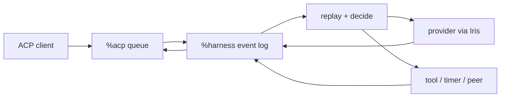

# Architecture

Harness separates a deterministic agent head from asynchronous hands. The head
owns durable sessions and decides the next event. Providers, tools, timers,
peers, and clients cross explicit boundaries and return facts to that log.

## Desk shape

One `%harness` desk declares four Gall agents:

| Agent | Responsibility |
|---|---|
| `%harness` | Session logs, replay, decisions, provider requests, tools, policy |
| `%acp` | Durable, ordered, per-client duplex JSON-RPC queues |
| `%harness-grub` | Minimal Grubbery process/effect runtime |
| `%harness-fileserver` | Authenticated static React application |

`desk/lib/root.hoon` loads only the Grubbery services needed for Fibers and
effects: Eyre, Iris, Behn, Clay, and scry. It does not seed a desktop, example
applications, or a competing agent tree.

## Session ownership

A session is `[log next-req]`. Its closed event vocabulary includes admitted
input, configuration, provider requests and results, tool requests and
results, compaction, retry, and halt. `play` folds the log into a derived view;
`decide` selects the next step; Gall emits effects and records their results.



Admission is fast because a prompt becomes an event before inference begins.
Each session advances independently, so one slow provider call does not block
another conversation. A cancellation records a terminal event and stale
responses are ignored by request identity.

The complete semantic transcript remains on ship. Only a bounded request view
is sent to a provider. Compaction stores a summary while retaining the event
record from which the current view is derived.

## Grubbery's role

Grubbery is the modular process substrate, not the product namespace. Its
nexus, Fiber, Dart, road, and weir vocabulary gives Harness a path toward small
supervised capabilities with explicit authority:

- Fibers describe asynchronous programs.
- Darts name effects outside deterministic state.
- Roads address resources.
- Weirs constrain the roads a capability can reach.
- Child processes isolate work and make failure inspectable.

Harness can therefore grow tools, channels, storage hands, or local inference
as optional processes instead of enlarging its central decision loop. The
minimal root keeps that direction available without shipping unrelated apps.

## Providers

Session configuration is data:

```text
endpoint, model, session key, headers, system instructions,
context budget, enabled tool families
```

Known endpoints select a per-provider credential. A session key can override
that credential, and arbitrary headers support compatible gateways. OpenRouter,
OpenAI API keys, Anthropic, and custom endpoints use the OpenAI Chat
Completions shape. OpenAI device login uses the ChatGPT Codex Responses shape
and its streamed event envelope behind the same session boundary.

Model catalogs are fetched by Iris and returned through the requesting ACP
connection. Catalog failure never prevents a manually entered model name.

## Tools and authority

Tool families are granted per conversation. New conversations enable the
current catalog—ship time, Clay reads, public web requests, skills, governed
skill writing, authoring, child sessions, and peer asks—and each conversation
can narrow that set independently. Tool calls are durable events; asynchronous
results can arrive in any order and settle the waiting turn when complete.

Skills have a staged workflow: propose, rehearse in a child session, then
commit or discard. Peer work uses Urbit identity and explicit grants for model,
budget, visible skills, and tools. A social desk may later act as an optional
channel, but it is not an identity or runtime dependency.

## ACP

`%acp` transports opaque JSON-RPC frames. Every connection has independently
sequenced client and agent queues with cumulative acknowledgement. `%harness`
watches the agent side once and routes responses back to the connection that
made the request. Disconnecting a browser cannot consume another client's
reply.

The React app uses this boundary for conversations, replay, prompts,
cancellation, configuration, credentials, and model discovery. The stdio
adapter projects the same queues to NDJSON. Neither client owns a transcript.

## Trust boundaries

- `%harness` owns the authoritative event logs.
- `%acp` owns delivery, not session meaning.
- Provider credentials remain agent state and are never returned by status.
- ACP does not advertise ambient filesystem or terminal access.
- Tool families are explicit session grants.
- External channels and remote peers require narrow typed adapters.

## Build discipline

`build.zig` pins Grubbery, assembles its libraries and marks, adapts its Clay
desk identity, renames the runtime agent, and overlays this desk. A release is
validated by building into a mounted `%harness` desk, committing through Clay,
compiling all four agents, opening multiple ACP connections, and completing a
real provider turn. The roadmap records further checks that should become
automated.
