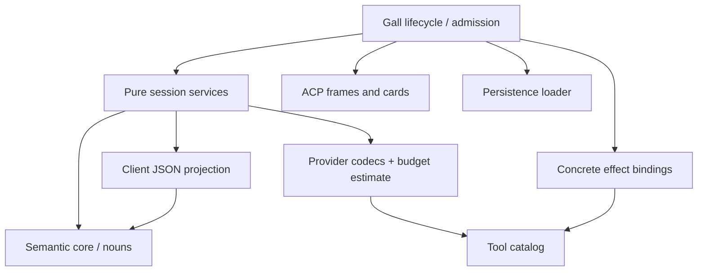
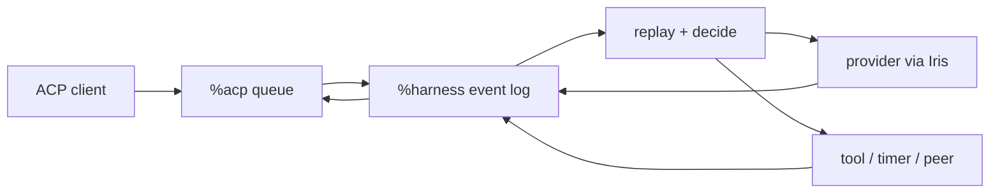

# Architecture

Harness is an Urbit-native durable agent head and effect router. The head owns
durable sessions and decides the next event. Providers, tools, timers, peers,
channels, sandboxes, and clients are replaceable hands that cross typed
boundaries and return facts to the log. The React interface is an inspector and
control panel, not the application boundary.

## Desk shape

One `%harness` desk declares five Gall agents:

| Agent | Responsibility |
|---|---|
| `%harness` | Session logs, replay, decisions, provider requests, tools, policy |
| `%acp` | Durable, ordered, per-client duplex JSON-RPC queues |
| `%harness-grub` | Minimal Grubbery process/effect runtime |
| `%harness-fileserver` | Authenticated static React application |
| `%harness-tlon` | Optional Groups/DM hand: actor grants, routing, Story delivery |

`desk/lib/root.hoon` loads only the Grubbery services needed for Fibers and
effects: Eyre, Iris, Behn, Clay, and scry. It does not seed a desktop, example
applications, or a competing agent tree.
Runtime startup retains its code/Clay watch, process clock, HTTP bindings and
recovery of explicitly opened Gall/Lick resources. It does not initialize terminal,
keyring, peer-directory or browser-push services, or implicitly mirror `%base`.
Previously mounted desks and durable service data are preserved; retiring old
subscriptions is separate from deciding what a fresh boot should initialize.

## Code boundaries

The **semantic core** is `sur/harness.hoon` plus `lib/harness.hoon`: vocabulary,
replay, transcript, cancellation, continuation and loop guards. The reducer
has no JSON, provider, credential or Gall dependency. Its budget argument is a
pure gate returning an estimate, evaluated only when inference could run.
Idle sessions and in-flight tools therefore do not pay for request encoding.

`outcome` classifies a settled turn as a reply, failure or cancellation. It
returns no outcome while effects are outstanding. ACP, conversation hands,
subagents and peer asks all use this gate; they choose delivery format and
diagnostic visibility, not completion semantics. A config edit does not clear
cancellation. Both completion and cancellation run the same settlement path,
so cancelling a child answers its parent's waiting tool instead of stranding it.
An empty assistant reply is valid; absence of a final reply is not success.

`harness-session` composes those semantics with the provider boundary's request
byte estimate and client snapshot projection. This is a pure service boundary,
shared by Gall and the supervised verifier, not another execution owner.

The arrows below mean **code dependencies**, not message delivery:



The contingent pieces have narrow jobs:

| Module | Owns | Does not own |
|---|---|---|
| `harness-provider` | Request/response formats, streaming parse, model metadata | Credentials, accepted results, scheduling |
| `harness-json` | Client projections and command decoding | Persisted state or provider wire formats |
| `harness-tools` | Schemas, function-to-family grants, executor safeguards | Tool execution |
| `harness-effects` | Concrete ship reads and HTTP/MCP/timer/peer cards | Session store or continuation |
| `harness-acp` | ACP frames, terminal updates and transport cards | Prompt ownership or admission |
| `harness-defaults` | Bootstrap instructions and policy | Existing conversation configuration |
| `sur/lib/harness-store` | Exact saved envelopes and version conversion | The running decision loop |

Gall keeps admission, authorization, request identities, event appends and
settlement together because its state and emitted cards commit in one event.
The effect door receives only the bowl and MCP registry; the ACP door receives
only our ship identity. Neither receives the session store. These are trusted
code boundaries, not substitutes for the Grubbery weirs that sandbox processes.
The explicit persistence constructors remain verbose on purpose: every field
retained across a saved-state version must be auditable.

To extend Harness, choose the boundary before adding a special case:

- **A provider/protocol:** change codecs and execution-time credential routing;
  return the same Harness result nouns, without changing replay.
- **A tool:** add its catalog/grant mapping and concrete binding; retain the
  head's execution-time authorization and intent-before-dispatch ordering.
- **A client or chat surface:** use ACP or native nouns; do not add a scheduler.
- **A policy:** change defaults or session configuration, not saved history.
- **A new lifecycle meaning:** change the noun vocabulary, reducer and tests
  together; that is a core change, not an adapter convenience.

In React, `acp.js` owns transport, `api.js` maps resource queries/commands,
`useSession` owns the replaceable live view, and `useResource` polls settings.
Resource keys are ACP lookup keys, not Grubbery roads. A resource generation
fences responses from a closed view or reads begun before an acknowledged
save. UI bootstrap defaults live separately from the transport facade and
never overwrite ship-owned policy merely because a component mounts.

## Session ownership

A session is `[log next-req]`. Its closed event vocabulary includes sourced
input, configuration, provider requests and results, tool requests and results,
compaction, cancellation, fork ancestry, retry, and halt. `play` folds the log
into a derived view; `decide` selects the next step; Gall emits effects and
records their results. Earlier session events are never removed to manufacture
a new state: cancellation appends what it abandoned, and a fork appends its
parent and divergence count.



Every new input has a durable identifier, source, actor when known, admission
time, and reply target. ACP, direct pokes, timers, webhooks, peers, subagents,
and rehearsals enter through this envelope. Admission is fast because a prompt
becomes an event before inference begins.
Each session advances independently, so one slow provider call does not block
another conversation. A cancellation records a terminal event and stale
responses are ignored by request identity.

Cancellation also closes every unfinished tool exchange with a derived
cancellation receipt, retaining any results already accepted. Replay, ACP,
and snapshots project these receipts from the cancellation event; the log is
not rewritten. New input therefore reaches the provider after a complete tool
exchange and does not redispatch interrupted calls. A stopped session stays
stopped through configuration changes until new input or an explicit retry.
Outstanding HTTP waits are withdrawn locally; cancellation cannot promise
that an external action was rolled back or never happened.

Native consumers can scry either a derived session view or its chronological
event projection. Subscriptions deliver typed `%harness-update` facts; clients
that understand Harness nouns do not have to pass through ACP or React.

The complete semantic transcript remains on ship. Only a bounded request view
is sent to a provider. Compaction stores a summary while retaining the event
record from which the current view is derived.

`lib/harness-session.hoon` exposes pure `next`, `inspect`, `snapshot`, and `branch`
gates. `inspect` returns the revision, replayed view, and next decision; it
does not execute the decision. `snapshot` derives the complete transcript
directly from events, independent of compaction. Entries carry their one-based
event count and, for sourced input, its durable input identity. Replay collects
items by prepending and reverses once, avoiding repeated prefix copying.

`branch` accepts an event count ending at a completed, tool-free assistant
reply. The child shares the immutable log tail and appends provenance; it does
not rerun inherited effects. Unfinished tool exchanges and invalid boundaries
are rejected. Gall's `%fork-at` action and ACP's `harness/session/fork` call use
this same gate. The gates are a reusable head boundary, not a second scheduler.

## Grubbery's role

Grubbery is the modular process substrate, not the product namespace. Its
nexus, Fiber, Dart, road, and weir vocabulary gives Harness a path toward small
supervised capabilities with explicit authority:

- Fibers describe asynchronous programs.
- Darts name effects outside deterministic state.
- Roads address resources.
- Weirs constrain the roads a capability can reach.
- Child processes isolate work and make failure inspectable.

Harness can therefore grow tools, channels, storage hands, or local inference
as optional processes instead of enlarging its central decision loop. The
minimal root keeps that direction available without shipping unrelated apps.

Every Gall session has a supervised verifier delegated by the root nexus to
`lib/harness-session-nexus.hoon`. The head publishes a source noun under
`/agents/main/shadow-inputs/<session>` containing the session, visible skills
and expected replay/decision digest. A separate Fiber runs the same pure
`harness-session` gates, writes the session mirror under
`/agents/main/sessions/<session>`, and records its check under
`/agents/main/checks/<session>`.

The source and outputs are separate grubs: a verifier cannot rewrite the
authoritative log. Its weir permits only writes to the two result directories,
with no cross-grub reads, service pokes or raw Gall syscalls. Snapshot writes
are idempotent, identified by destination and content; they require neither
entropy requests nor read-before-write exchanges. The Fiber remains waiting
after its check instead of completing and deleting its source grub.

On a failure it checkpoints `[%failed source trace]` in its own noun grub and
waits for an explicit retry. Recording the failure requires no extra
capability, so a denied output write cannot cause a crash-report retry loop.
The checkpoint survives process reconstruction and root reload. Valid source
replacement restarts the check; an owner can also poke the source to retry it.

ACP `harness/session/verify` (with `sessionId`) and native
`/x/verification/<session>` return the authoritative revision and latest check.
Require `matched: true`, equal revisions, and `check.actual` equal to
`authoritativeDigest`; the latter also checks decisions against currently
visible skills, which can change independently of the session revision. A null
or stale check is not evidence about the current head. A crashed check includes a trace digest, not
potentially sensitive diagnostic text. The full source/trace is owner-readable
in its grub. Outputs are JSON-shaped nouns with a total `%noun` storage mark;
the inspector validates locally so malformed diagnostics cannot fail an ACP
update. ACP `harness/session/recheck` republishes the current authoritative
source without adding a semantic event or running inference.

This is an independent replay/current-decision checkpoint, **not a second
executor** and not proof that every actual dispatched effect was correct.
Snapshots often include an already-pending effect, so the next decision can
be empty. Capturing and comparing the complete intent/receipt sequence at
dispatch boundaries remains necessary before moving session ownership.
`%harness` remains authoritative; native apps and ACP clients share its head.

The intended namespace is:

```text
/agents/<agent>/
  profile/
  policies/
  skills/
  tools/
  sessions/<session>/
    config
    events
    view
    inbox.sig
    outbox/
    runs/<run-id>/{intent,progress,receipt}
    children/
  channels/
  executors/
```

The session grubs can grow into supervised reducers; each open effect can then
become a child run. Skills, policies, and tool bundles become versioned
namespace files. Weirs enforce the same capability grants that the reducer
checks before dispatch. Promotion is staged behind replay-conformance tests so
`%harness-grub` only becomes authoritative after identical event logs produce
identical views and effects.

## Providers

Agent defaults and session configuration are data:

```text
endpoint, model, headers, system instructions,
context budget, enabled tool families
```

Known endpoints select a per-provider credential held outside the session log;
arbitrary headers support compatible gateways. OpenRouter,
OpenAI API keys, Anthropic, and custom endpoints use the OpenAI Chat
Completions shape. OpenAI device login uses the ChatGPT Codex Responses shape
and its streamed event envelope behind the same session boundary.

New conversations snapshot the durable agent defaults and may then diverge.
Model catalogs are fetched by Iris and returned through the requesting ACP
connection. When a provider publishes context-window metadata, selecting that
model updates the session budget automatically. Catalog failure or absent
metadata never prevents a manually entered model name.

The [context and memory proposal](context-and-memory.md) separates authoritative
history from model context and derived recall indexes. Bounded compaction uses
frozen source plans, separate summary usage and shared `/context` and `/compact`
commands. Stable session identity, paged history and memory/index services remain
planned work; compaction does not bound full-log replay cost.

## Tools and authority

Tool families are granted per conversation. Owner-created interactive
conversations explicitly receive the current catalog—ship time, Clay reads,
public web requests, skills, governed skill writing, authoring, child sessions,
peer asks, and configured MCP servers—and can narrow it independently. Remote,
scheduled, delegated, and rehearsal sessions receive purpose-built grants. Provider-visible schemas
are discovery only: execution resolves every function name to a family and
checks the current grant again; internal self-pokes must also correspond to a
durable outstanding call.

Skills have a staged workflow: propose, rehearse in a child session, then
commit or discard. Peer work uses Urbit identity and explicit grants for model,
budget, visible skills, and tools. A social desk may later act as an optional
channel, but it is not an identity or runtime dependency.

## ACP

`%acp` transports opaque JSON-RPC frames. Every connection has independently
sequenced client and agent queues with cumulative acknowledgement. `%harness`
watches the agent side once and routes responses back to the connection that
made the request. Disconnecting a browser cannot consume another client's
reply.

The React inspector uses this boundary for conversations, replay, prompts,
cancellation, configuration, credentials, and model discovery. The stdio
adapter projects the same queues to NDJSON. Neither client owns a transcript.

`session/close` detaches a client without stopping the session. Cancellation is
explicit, works from a different authorized client, and settles the outstanding
prompt. Any client can read `harness/session/snapshot`, including during work
started elsewhere. The browser reconciles snapshots rather than treating its
private notification queue as the authoritative transcript. Admission receipts
connect a local message id to the ship's durable input id.

Presentation chunks are not semantic session events, but the current transport
still carries them through Arvo and durable ACP queues. A truly off-ship live
stream requires an executor-to-client path; it is not provided by labeling
chunks transient. Similarly, effect intent/receipt nouns currently describe a
contract to implement across all hands, not an executor boundary already in use.

## Trust boundaries

- `%harness` owns the authoritative event logs.
- `%acp` owns delivery, not session meaning.
- Provider credentials remain separate agent state, are blanked before config
  admission, and are never returned by status.
- ACP does not advertise ambient filesystem or terminal access.
- Tool families are explicit session grants.
- External channels and remote peers require narrow typed adapters.

## Build discipline

`build.zig` pins Grubbery, assembles its libraries and marks, adapts its Clay
desk identity, renames the runtime agent, and overlays this desk. A release is
validated by assembling into a fresh `%harness` desk, committing through Clay,
compiling all five agents, opening multiple ACP connections, and completing a
real provider turn. The roadmap records further checks that should become
automated.

Production assembly removes the runtime's development-test Ford imports along
with its test suite. The dynamic namespace includes the four compiler bootstrap
marks plus `%noun`, required for the head/verifier exchange. Without it, a fresh
runtime stores inputs unvalidated and cannot start their processes. Artifact
checks in `scripts/distribution.test.mjs` catch these packaging omissions before
deployment; the live cancellation and verifier tests exercise the boundary.

For incremental development, assemble to `zig-out` and copy the intended
overlay files to the mounted desk. Full synchronization removes files absent
from the build output; do not accidentally prune test dependencies or other
mounted development files. Run `-test /=harness=/tests/harness` for pure head
checks and `scripts/conformance.mjs` for live two-client checks.
