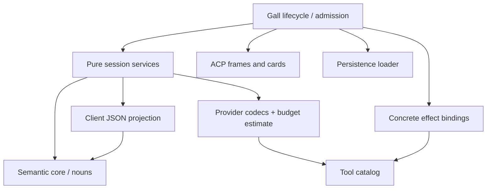
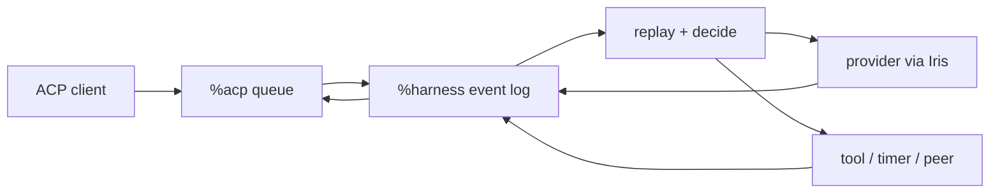

# Architecture

Harness keeps conversations on the ship. The **head**, `%harness`, records
inputs and results, replays history, and decides what runs next. Clients display
and control that work. Model providers generate responses.

**Hands** connect chat surfaces to the head's input queue and delivery ledger.
Providers and tools have separate execution paths.

## Mental model

| Concept | Meaning |
| --- | --- |
| Session | Durable event log plus request identity; independent conversation state |
| View | State derived by replaying that log |
| Model context | Selected instructions, notes, summaries, recent exchanges and tool schemas |
| Client connection | Transport queue and subscriptions, not the session itself |
| Binding | Authorized route from a surface and actors to a session |
| Publication | A terminal answer awaiting external delivery, tracked independently of inference |
| Grant | Permission to use a tool family or named resource |
| Receipt | Evidence of a particular result or delivery attempt, not universal proof of remote completion |

The same history supplies the human transcript, model context, search index,
and replay checks.

## Desk shape

One `%harness` desk declares five Gall agents:

| Agent | Responsibility |
|---|---|
| `%harness` | Session logs, replay, decisions, provider requests, tools, policy |
| `%acp` | Durable, ordered, per-client duplex JSON-RPC queues |
| `%harness-grub` | Minimal Grubbery process/effect runtime |
| `%harness-fileserver` | Authenticated static React application |
| `%harness-tlon` | Optional Groups/DM hand: actor grants, routing, Story delivery |

`desk/lib/root.hoon` loads Grubbery's Eyre, Iris, Behn, Clay, and scry services.
Startup restores code watches, the process clock, HTTP bindings, and explicitly
opened Gall/Lick resources. Desktop, terminal, keyring, peer-directory,
browser-push services, and implicit `%base` mirroring are excluded.

## Code boundaries

The **semantic core** is `sur/harness.hoon` plus `lib/harness.hoon`: vocabulary,
replay, transcript, cancellation, continuation and loop guards. The reducer
has no JSON, provider, credential or Gall dependency. Its budget argument is a
pure gate returning an estimate, evaluated only when inference could run.
Idle sessions and in-flight tools therefore do not pay for request encoding.

`outcome` classifies a settled turn as a reply, failure or cancellation. It
returns no outcome while effects are outstanding. ACP, conversation hands,
subagents and peer asks all use this gate; they choose delivery format and
diagnostic visibility, not completion semantics. A config edit does not clear
cancellation. Both completion and cancellation run the same settlement path,
so cancelling a child answers its parent's waiting tool instead of stranding it.
An empty assistant reply is valid; absence of a final reply is not success.

`harness-session` combines the core with request-size estimates and snapshots.
Gall and the verifier use the same pure functions.

The arrows below mean **code dependencies**, not message delivery:



| Module | Responsibility |
| --- | --- |
| `harness-provider` | Provider formats, streaming, model metadata |
| `harness-json` | Client views and command decoding |
| `harness-tools` | Tool schemas, grant mapping, executor safeguards |
| `harness-effects` | Ship reads and HTTP/MCP/timer/peer dispatch |
| `harness-curl` | HTTP validation, requests, and response formatting |
| `harness-acp` | ACP frames, terminal updates, transport |
| `harness-defaults` | Initial instructions and policy |
| `harness-lcm` / `harness-lcm-context` | Summary hierarchy, planning, validation |
| `harness-corpus` / `harness-corpus-index` | Incremental source projection and search index |
| `harness-corpus-json` | Search, source reads, summary expansion |
| `sur/harness-store` / `lib/harness-store` | Saved-state types and loading |

Gall commits state changes and emitted cards in one event, keeping authorization,
recording, dispatch, and settlement atomic. The effect door receives the bowl
and MCP registry; the ACP door receives the ship identity. Neither receives
session storage. Process isolation is supplied separately by Grubbery weirs.

To extend Harness, choose the boundary before adding a special case:

- **A provider/protocol:** change codecs and execution-time credential routing;
  return the same Harness result nouns, without changing replay.
- **A tool:** add its catalog/grant mapping and concrete binding; retain the
  head's execution-time authorization and intent-before-dispatch ordering.
- **A client or chat surface:** use ACP or native nouns; do not add a scheduler.
- **A policy:** change defaults or session configuration, not saved history.
- **A new lifecycle meaning:** change the noun vocabulary, reducer and tests
  together; that is a core change, not an adapter convenience.

In React, `acp.js` owns transport, `api.js` maps resource queries/commands,
`useSession` owns the replaceable live view, and `useResource` polls settings.
Resource keys are ACP lookup keys, not Grubbery roads. A resource generation
fences responses from a closed view or reads begun before an acknowledged
save. UI bootstrap defaults live separately from the transport facade and
never overwrite ship-owned policy merely because a component mounts.

## Session ownership

A session is `[log next-req]`. Its closed event vocabulary includes sourced
input, configuration, provider requests and results, tool requests and results,
compaction, cancellation, fork ancestry, retry, and halt. `play` folds the log
into a derived view; `decide` selects the next step; Gall emits effects and
records their results. Earlier session events are never removed to manufacture
a new state: cancellation appends what it abandoned, and a fork appends its
parent and divergence count.



Every new input has a durable identifier, source, actor when known, admission
time, and reply target. ACP, direct pokes, timers, webhooks, peers, subagents,
and rehearsals enter through this envelope. Admission is fast because a prompt
becomes an event before inference begins.
Each session advances independently, so one slow provider call does not block
another conversation. A cancellation records a terminal event and stale
responses are ignored by request identity.

Cancellation also closes every unfinished tool exchange with a derived
cancellation receipt, retaining any results already accepted. Replay, ACP,
and snapshots project these receipts from the cancellation event; the log is
not rewritten. New input therefore reaches the provider after a complete tool
exchange and does not redispatch interrupted calls. A stopped session stays
stopped through configuration changes until new input or an explicit retry.
Outstanding HTTP waits are withdrawn locally; cancellation cannot promise
that an external action was rolled back or never happened.

Native consumers can scry either a derived session view or its chronological
event projection. Subscriptions deliver typed `%harness-update` facts; clients
that understand Harness nouns do not have to pass through ACP or React.

The semantic transcript remains on ship; model requests use a selected context
view. Budget checks and compaction reduce request size without deleting source
events. Estimates are not exact tokenization, and an indivisible oversized
exchange can fail locally. See [context and memory](context-and-memory.md).

`lib/harness-session.hoon` exposes pure `next`, `inspect`, `snapshot`, and `branch`
gates. `inspect` returns the revision, replayed view, and next decision; it
does not execute the decision. `snapshot` derives the complete transcript
directly from events, independent of compaction. Entries carry their one-based
event count and, for sourced input, its durable input identity. Replay collects
items by prepending and reverses once, avoiding repeated prefix copying.

`branch` accepts an event count ending at a completed, tool-free assistant
reply. The child shares the immutable log tail and appends provenance; it does
not rerun inherited effects. Unfinished tool exchanges and invalid boundaries
are rejected. Gall's `%fork-at` action and ACP's `harness/session/fork` call use
this same gate.

## Grubbery's role

Grubbery provides supervised processes and constrained resource access.
Its vocabulary describes the runtime:

- Fibers describe asynchronous programs.
- Darts name effects outside deterministic state.
- Roads address resources.
- Weirs constrain the roads a capability can reach.
- Child processes isolate work and make failure inspectable.

Harness uses this runtime for session mirrors and separate replay verification.
Optional process-based adapters can use its supervision and resource boundaries
without becoming conversation owners.

Every Gall session has a supervised verifier delegated by the root nexus to
`lib/harness-session-nexus.hoon`. The head publishes a source noun under
`/agents/main/shadow-inputs/<session>` containing the session, visible skills
and expected replay/decision digest. A separate Fiber runs the same pure
`harness-session` gates, writes the session mirror under
`/agents/main/sessions/<session>`, and records its check under
`/agents/main/checks/<session>`.

The source and outputs are separate grubs: a verifier cannot rewrite the
authoritative log. Its weir permits only writes to the two result directories,
with no cross-grub reads, service pokes or raw Gall syscalls. Snapshot writes
are idempotent, identified by destination and content; they require neither
entropy requests nor read-before-write exchanges. The Fiber remains waiting
after its check instead of completing and deleting its source grub.

On a failure it checkpoints `[%failed source trace]` in its own noun grub and
waits for an explicit retry. Recording the failure requires no extra
capability, so a denied output write cannot cause a crash-report retry loop.
The checkpoint survives process reconstruction and root reload. Valid source
replacement restarts the check; an owner can also poke the source to retry it.

ACP `harness/session/verify` (with `sessionId`) and native
`/x/verification/<session>` return the authoritative revision and latest check.
Require `matched: true`, equal revisions, and `check.actual` equal to
`authoritativeDigest`; the latter also checks decisions against currently
visible skills, which can change independently of the session revision. A null
or stale check is not evidence about the current head. A crashed check includes a trace digest, not
potentially sensitive diagnostic text. The full source/trace is owner-readable
in its grub. Outputs are JSON-shaped nouns with a total `%noun` storage mark;
the inspector validates locally so malformed diagnostics cannot fail an ACP
update. ACP `harness/session/recheck` republishes the current authoritative
source without adding a semantic event or running inference.

Verification checks replay and the current decision using the same reducer.
It does not independently prove the reducer correct or check the full sequence
of dispatched effects and receipts. A snapshot with a pending effect may have
no next decision. Only the head executes work.

## Providers

Agent defaults and session configuration are data:

```text
endpoint, model, headers, system instructions,
context budget, enabled tool families
```

Known endpoints select a provider credential held outside the session log;
arbitrary headers support compatible gateways. OpenRouter, OpenAI API keys,
Anthropic and custom endpoints use the OpenAI Chat Completions shape.
OpenAI device login uses the ChatGPT Codex Responses shape and its streamed
event envelope behind the same session boundary. API and device credentials
are separate; device tokens renew on use on the ship. See
[authentication](acp.md#provider-authentication).

New conversations snapshot the durable agent defaults and may then diverge.
Model catalogs are fetched by Iris and returned through the requesting ACP
connection. When a provider publishes context-window metadata, selecting that
model updates the session budget automatically. Catalog failure or absent
metadata never prevents a manually entered model name.

See [context and memory](context-and-memory.md) for compaction, summary models,
source-linked recall, and request budgets.

## Tools and authority

Tool grants belong to each conversation. Defaults include broad Clay, HTTP,
skills, subagents, peers, corpus, and ship-wide Tlon access; MCP needs named
server grants. Destination-scoped Tlon tools come from live hands. New owner
conversations inherit defaults; saved conversations keep their settings.

Remote, scheduled, delegated, and rehearsal sessions have additional restrictions.
Dispatch rechecks each function's grant, and internal self-pokes must match a
recorded outstanding call. A visible schema alone does not authorize execution.

The opt-in `%code` grant runs QuickJS/WASM through Spider with broad host APIs.
It has a 64 KiB source limit, common-loop checks, and a 30-second yielding
watchdog, but no hard CPU isolation. See [JavaScript execution](execution.md)
for inheritance, cancellation, and host permissions.

MCP is granted per server, not per tool: JSON grants use `{"mcp":"server-id"}`
alongside ordinary family strings. Discovery filters the enabled registry by
those exact IDs; both dispatch and delayed HTTP receipt admission check the
current grant. Disabled or removed servers cannot return tool bodies. Revocation
cannot undo requests already accepted by an external server. IDs are authority
identities: replacing an endpoint under the same ID retains its grants, so do not
reuse an ID for an unrelated server.

Clay grants name component-wise prefixes, such as `{"clay":"/harness/lib"}`.
They permit reads and listings at that path and below, not sibling paths or
ancestor listings. Discovery exposes only granted roots. Reads fetch raw stored
nouns and render known formats locally; desk-defined converters never execute.
The `{"clay":"/"}` grant permits reads across all desks. The UI labels it as
broad and supports replacing it with paths. JSON policy requires an explicit
path object; a bare `clay` string does not grant access.

Search-provider configuration belongs to the effect owner, not model arguments.
Brave and SearXNG both use `web_search` and the Web grant. Pending searches
retain their dispatch provider across configuration changes and reloads.
SearXNG uses form POST to `<instance-base>/search`, with JSON results normalized
to the same bounded title/link/excerpt contract; Brave credentials are never
sent there.

The Tlon tool bridge illustrates the same boundary for native hands: the head
records a tool request, the hand validates its exact call and provider generation,
and a persisted hand receipt settles that outstanding exchange. Local Messenger
acknowledgement is distinct from remote delivery. Old invocation IDs cannot settle
new calls with a reused provider call ID. Optional hand authority is rechecked at
dispatch and receipt admission, including scheduled sessions' source grants.

`harness-cron` supplies UTC calendar logic; `harness-schedule` validates jobs.
The head stores schedules, owns the Behn wake, and admits due runs as idempotent
hand observations. Scheduled agents receive no parent transcript and cannot
create schedules or local subagents. Executors retain tool receipts; hands
deliver results. See [scheduling](scheduling.md).

Experimental skill authoring can stage, rehearse, publish or discard instructions.
It is enabled by bootstrap defaults. Rehearsals only retain inherited Clay
and skill reads; dispatch enforces that ceiling independently of saved config.
They consume inference and create session evidence, but cannot use web, MCP,
code execution, peers, child agents or skill mutations. Publication is a separate
shared-library mutation: the current tool has no owner-approval or successful-test
gate. A rehearsal answer is not a safety certificate. Direct skill writing is
also explicit, shared-library authority rather than conversation memory.
Peer work uses Urbit identity and explicit grants for model, budget, visible
skills, and tools. Social desks are optional channels, not runtime dependencies.

## ACP

`%acp` transports opaque JSON-RPC frames. Every connection has independently
sequenced client and agent queues with cumulative acknowledgement. `%harness`
watches the agent side once and routes responses back to the connection that
made the request. Disconnecting a browser cannot consume another client's
reply.

The React inspector uses this boundary for conversations, replay, prompts,
cancellation, configuration, credentials, and model discovery. The stdio
adapter projects the same queues to NDJSON. Neither client owns a transcript.

`session/close` detaches a client without stopping the session. Cancellation is
explicit, works from a different authorized client, and settles the outstanding
prompt. Any client can read `harness/session/snapshot`, including during work
started elsewhere. The browser reconciles snapshots rather than treating its
private notification queue as the authoritative transcript. Admission receipts
connect a local message id to the ship's durable input id.

Presentation chunks are not semantic session events. They still travel through
Arvo and durable ACP queues; there is no direct executor-to-client stream.

## Trust boundaries

- `%harness` owns the authoritative event logs.
- `%acp` owns delivery, not session meaning.
- Provider credentials remain separate agent state, are blanked before config
  admission, and are never returned by status.
- ACP does not advertise ambient filesystem or terminal access.
- Tool families are explicit session grants.
- `http_fetch` only emits GET, without a request body, injected credentials,
  redirects or transport retries. It is not a private-network isolation boundary:
  Iris does not expose DNS-answer validation with pinned public-IP connections.
  Arbitrary POST requests are not part of the web grant.
- `curl` has its own explicit `%curl` grant, included in bootstrap defaults.
  It uses native Iris, not a shell or external worker, and supports the runtime's
  nine HTTP methods, explicit string-valued headers and an optional UTF-8 body.
  There is no destination allowlist or private-address restriction. Request
  syntax/resource bounds are 8 KiB URL, 128 headers (256-byte names and 16 KiB
  values), and 4 MiB body. Credentials are never injected. Supplied headers and
  bodies are ordinary durable tool-call arguments, not a secret vault.
  Redirects default to zero; an explicit budget up to 20 enables Iris's native
  301/303/307 handling with absolute Location URLs, preserving the original
  method, headers and body even across hosts. Other redirects are returned for
  inspection. There are no automatic retries. Results include status, up to
  8,000 bytes each of response headers and body text; this is an output bound,
  not an Iris download-size cap. Cancellation withdraws the local wait and
  fences late receipts, but cannot undo a remote write. Destination-specific
  writes may instead use separately authorized hands or configured MCP servers.
- External channels and remote peers require narrow typed adapters.

## Durable workspace records

The head persists workspace metadata, native Notes links, project client
credentials and a disposable search index alongside conversations.
`harness-workspace` supplies pure metadata/proposal/task transitions;
`harness-notes` maps native Notes into bounded read projections. Notes owns body
history, titles and published HTML; Harness owns projects, grants, proposals,
source references and task claims. `harness-workspace-json` supplies bounded
projections and decoding, while `harness-document` renders inert public Markdown.

The head derives live access from immutable corpus scope IDs and active
delegations, never model-supplied identity. Agents with Workspace access share
task tracking and project metadata; document access uses project roles.
Task records describe work without dispatching execution or granting authority.
Models can propose document revisions; owner-only approval, membership and
publication remain separate.
Read execution and receipt settlement occur in one Gall event. Native writes
persist their intent, watch the request result before sending, and settle only
on the typed Notes result, never merely on poke acknowledgement. Uncertain writes
are not automatically repeated. Public reads use Notes' stored HTML snapshot,
not the owner projection. Native notebook permissions remain independent of
Harness project access.

`harness-workspace-search` incrementally indexes accepted Notes revisions and
current project/task metadata using inverted term postings and per-revision
match masks. Background work is bounded; query terms must match the same revision.
`harness-unified-search` merges conversation hits and grouped workspace hits before
pagination. Cursor/source tokens fence query, index and live workspace changes;
unavailable Notes content fails closed. This owner search API does not widen
model tool grants or change conversation-only corpus recall.
See [workspace interfaces and limits](workspaces.md).

## Build and verification

Zig assembles the minimal Grubbery runtime, its required marks and this desk's
overlay. The runtime and head are installed together; Tlon remains an optional
integration with a separately installed Groups desk.

See [development](development.md) for build safety, native tests, artifact checks
and live lifecycle fixtures. Verification distinguishes replay agreement,
actual effect results and external delivery evidence.
