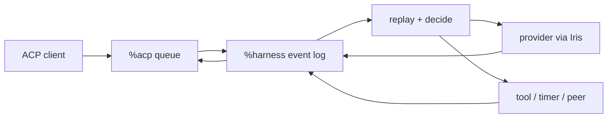

# Architecture

Harness is an Urbit-native durable agent head and effect router. The head owns
durable sessions and decides the next event. Providers, tools, timers, peers,
channels, sandboxes, and clients are replaceable hands that cross typed
boundaries and return facts to the log. The React interface is an inspector and
control panel, not the application boundary.

## Desk shape

One `%harness` desk declares four Gall agents:

| Agent | Responsibility |
|---|---|
| `%harness` | Session logs, replay, decisions, provider requests, tools, policy |
| `%acp` | Durable, ordered, per-client duplex JSON-RPC queues |
| `%harness-grub` | Minimal Grubbery process/effect runtime |
| `%harness-fileserver` | Authenticated static React application |

`desk/lib/root.hoon` loads only the Grubbery services needed for Fibers and
effects: Eyre, Iris, Behn, Clay, and scry. It does not seed a desktop, example
applications, or a competing agent tree.

## Session ownership

A session is `[log next-req]`. Its closed event vocabulary includes sourced
input, configuration, provider requests and results, tool requests and results,
compaction, cancellation, fork ancestry, retry, and halt. `play` folds the log
into a derived view; `decide` selects the next step; Gall emits effects and
records their results. Earlier session events are never removed to manufacture
a new state: cancellation appends what it abandoned, and a fork appends its
parent and divergence count.



Every new input has a durable identifier, source, actor when known, admission
time, and reply target. ACP, direct pokes, timers, webhooks, peers, subagents,
and rehearsals enter through this envelope. Admission is fast because a prompt
becomes an event before inference begins.
Each session advances independently, so one slow provider call does not block
another conversation. A cancellation records a terminal event and stale
responses are ignored by request identity.

Native consumers can scry either a derived session view or its chronological
event projection. Subscriptions deliver typed `%harness-update` facts; clients
that understand Harness nouns do not have to pass through ACP or React.

The complete semantic transcript remains on ship. Only a bounded request view
is sent to a provider. Compaction stores a summary while retaining the event
record from which the current view is derived.

## Grubbery's role

Grubbery is the modular process substrate, not the product namespace. Its
nexus, Fiber, Dart, road, and weir vocabulary gives Harness a path toward small
supervised capabilities with explicit authority:

- Fibers describe asynchronous programs.
- Darts name effects outside deterministic state.
- Roads address resources.
- Weirs constrain the roads a capability can reach.
- Child processes isolate work and make failure inspectable.

Harness can therefore grow tools, channels, storage hands, or local inference
as optional processes instead of enlarging its central decision loop. The
minimal root keeps that direction available without shipping unrelated apps.

Today, every Gall session is also projected as one typed `%noun` grub at
`/agents/main/sessions/<session>`. This is deliberately a simple, replaceable
shadow: it exercises the durable namespace and thin client boundary without
putting another scheduler in the prompt path. `%harness` remains authoritative
until replay and effect conformance make a supervised session process safe to
promote.

The intended namespace is:

```text
/agents/<agent>/
  profile/
  policies/
  skills/
  tools/
  sessions/<session>/
    config
    events
    view
    inbox.sig
    outbox/
    runs/<run-id>/{intent,progress,receipt}
    children/
  channels/
  executors/
```

The session grubs can grow into supervised reducers; each open effect can then
become a child run. Skills, policies, and tool bundles become versioned
namespace files. Weirs enforce the same capability grants that the reducer
checks before dispatch. Promotion is staged behind replay-conformance tests so
`%harness-grub` only becomes authoritative after identical event logs produce
identical views and effects.

## Providers

Agent defaults and session configuration are data:

```text
endpoint, model, headers, system instructions,
context budget, enabled tool families
```

Known endpoints select a per-provider credential held outside the session log;
arbitrary headers support compatible gateways. OpenRouter,
OpenAI API keys, Anthropic, and custom endpoints use the OpenAI Chat
Completions shape. OpenAI device login uses the ChatGPT Codex Responses shape
and its streamed event envelope behind the same session boundary.

New conversations snapshot the durable agent defaults and may then diverge.
Model catalogs are fetched by Iris and returned through the requesting ACP
connection. When a provider publishes context-window metadata, selecting that
model updates the session budget automatically. Catalog failure or absent
metadata never prevents a manually entered model name or context limit.

## Tools and authority

Tool families are granted per conversation. Owner-created interactive
conversations explicitly receive the current catalog—ship time, Clay reads,
public web requests, skills, governed skill writing, authoring, child sessions,
peer asks, and configured MCP servers—and can narrow it independently. Remote,
scheduled, delegated, and rehearsal sessions receive purpose-built grants. Provider-visible schemas
are discovery only: execution resolves every function name to a family and
checks the current grant again; internal self-pokes must also correspond to a
durable outstanding call.

Skills have a staged workflow: propose, rehearse in a child session, then
commit or discard. Peer work uses Urbit identity and explicit grants for model,
budget, visible skills, and tools. A social desk may later act as an optional
channel, but it is not an identity or runtime dependency.

## ACP

`%acp` transports opaque JSON-RPC frames. Every connection has independently
sequenced client and agent queues with cumulative acknowledgement. `%harness`
watches the agent side once and routes responses back to the connection that
made the request. Disconnecting a browser cannot consume another client's
reply.

The React inspector uses this boundary for conversations, replay, prompts,
cancellation, configuration, credentials, and model discovery. The stdio
adapter projects the same queues to NDJSON. Neither client owns a transcript.

## Trust boundaries

- `%harness` owns the authoritative event logs.
- `%acp` owns delivery, not session meaning.
- Provider credentials remain separate agent state, are blanked before config
  admission, and are never returned by status.
- ACP does not advertise ambient filesystem or terminal access.
- Tool families are explicit session grants.
- External channels and remote peers require narrow typed adapters.

## Build discipline

`build.zig` pins Grubbery, assembles its libraries and marks, adapts its Clay
desk identity, renames the runtime agent, and overlays this desk. A release is
validated by building into a mounted `%harness` desk, committing through Clay,
compiling all four agents, opening multiple ACP connections, and completing a
real provider turn. The roadmap records further checks that should become
automated.
