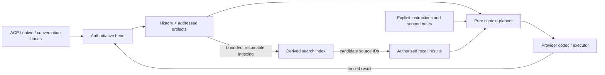
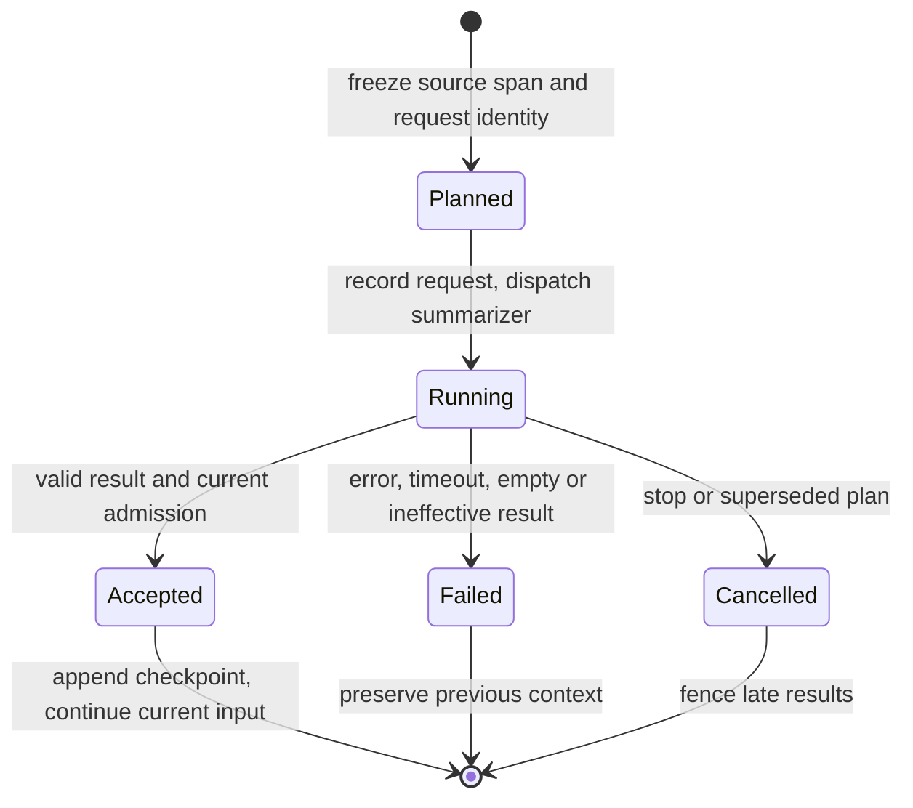

# Sessions, context and memory

Automatic compaction and bounded, explicit conversation notes are implemented
below. Stable session identity, paging and permission-scoped recall remain
proposed work. There is no memory daemon, extraction loop or search index.

## Implemented compaction boundary

`lib/harness-context.hoon` owns pure budgeting, source selection and validation.
Provider codecs supply estimates of the encoding actually dispatched; the head
records a `compaction-planned` event before emitting the request. The plan names
the source log boundary, active-prefix count/digest, original context length,
model/endpoint, estimated input, output reserve and optional command identity.
Replay of that log boundary recovers the exact source prefix and base summary.

The current policy reserves `min(4096, window / 4)` output tokens plus a 10%
estimation margin. These are explicit conservative policy constants, not
provider metadata or benchmark-derived optimal values. Chat Completions requests
send the matching output cap; the Codex subscription route retains its existing
provider-managed output behavior. All size estimates remain rounded bytes/4,
not exact tokenization. `/context` labels that uncertainty and the configured
window as catalog-or-fallback; precise metadata provenance is still future work.

Compaction responds to the active model's capacity, not an absolute working-set
cap. Before eligible inference, compare the encoded-request estimate with
`window - output-budget - floor(window / 10)`. Below that threshold, proceed
without summarizing; above it, plan compaction before dispatch. A larger model
can use its larger window. Switching to a smaller model immediately changes the
next decision; there is no cached threshold to invalidate. The window comes
from the session's catalog-derived configuration or its declared fallback.

Source selection aims to leave one third of that input budget as raw recent
exchanges, plus the checkpoint and other prompt material. This proportional
target provides room to grow; it is not an exact final-context bound. The next
request is measured again. Neither the trigger nor the tail has a separate
fixed token cap, and there is no UI context-size knob. The percentage margin,
tail ratio and output reservation are explicit policy, not provider metadata.

Selection keeps the latest completed exchange and unanswered input. It chooses
complete historical exchanges using a recent-tail budget target and chunks the
eligible prefix to fit the summary request's own budget. Tool calls/results are
never split. On already-short history, explicit compaction selects the older
exchanges together instead of summarizing only a potentially trivial first pair.
An indivisible oversized exchange fails locally; artifact storage
and projections are not implemented in this slice.

`checkpoint-completed` records the replacement and reported usage. The reducer
checks outstanding identity and the frozen source digest before replacing the
prefix, preserving any new tail input. A manual command acknowledgement is
placed at its admission boundary in model context so later input still needs an
answer; the human transcript records completion in event order. Historical text
is labelled reference material, not system/developer instructions.

Empty, truncated, tool-producing or non-reducing summaries fail without replacing
context or retrying automatically. Summary usage is included in cumulative usage
and separately reported as `compactionUsage`, including rejected summaries when
the provider reports usage. Missing usage remains zero, not an estimated charge.
Four attempts per admitted input bound automatic chunking; each summary has a
three-minute watchdog. Cancellation fences late results. Existing compaction
events retain their replay semantics; an in-flight summary without a source plan
cannot be accepted as a new checkpoint after reload.

`/context` and `/compact` share native, ACP and hand ingress. Only `/compact`
invokes inference. It requires no tools and publishes success only after the
checkpoint is accepted. Full source transcripts remain available. This does not
yet make full-log replay, history reads or request construction constant-cost.

## Implemented conversation memory

`lib/harness-memory.hoon` is a pure bounded-note policy. Notes are a map derived
from the same session event log, not a second database. Human ingress provides:

- `/remember project Keep the deployment read-only.` saves or replaces a note.
- `/memory` lists the current notes without inference.
- `/forget project` unpins a note without erasing earlier messages or summaries.

Names have 1–32 lowercase ASCII letters, digits, hyphens or underscores. Each
body is at most 1,024 UTF-8 bytes; each session allows at most 16 notes and
8,192 total name/body bytes. Replacements count against the resulting map.
Overflow is rejected explicitly; there is no silent eviction. These limits
bound current note content, not noun/map overhead, audit history, or backups.

Notes enter ordinary model requests verbatim as user-level reference material
and count toward request estimates. They are not passed as a separate block to
the summarizer, which cannot edit them; earlier note commands may still appear
in the history it summarizes. Removing a pin is therefore not an erasure or a
guarantee that a model cannot recall its old text. Notes are never promoted to
system instructions. Both Chat Completions and Responses use the same policy.

Notes inherit the session's access scope. A new independent conversation starts
empty; a fork carries notes at the selected history boundary and later changes
are independent. An admitted participant can edit that session's notes, not
another conversation's. Tlon actor isolation and hand authorization remain the
boundary; there is no new global memory grant. Clients inspect notes in session
snapshots/views as `memory: [{name, body}]`. A `memory-set` event records each
edit alongside the identified command input and acknowledgement.

There are no model-side note-writing tools or automatic fact extraction in this
slice. This avoids making guessed facts durable or writing private facts into
the shared skill library. Notes complement lossy rolling summaries, rather than
pretending to replace source history or provide cross-session recall.

Compaction bounds neither the primary transcript nor replay time. Every note
edit is another audit event, but no index, embedding store, per-turn extraction
request or periodic maintenance task is added. The next storage work is paged
history and replay-verified projections, followed by an explicit retention and
archive policy—not another automatically growing copy of the conversation.

## Decision

Keep **one authoritative history and several disposable views of it**. Make
compaction correct before making memory clever. Begin with source-addressed
checkpoints and explicit recall, not a global memory daemon or automatic
fact-extraction loop.

The useful promise is not “the model remembers everything.” It is: **the ship
can recover the evidence, explain what the model saw, and control who may recall
it**. A summary is lossy even when its sources remain recoverable. “Lossless”
should describe retention of those sources, not the quality of generated prose.



The arrows describe the intended responsibilities, not additional Gall agents.
The current Grubbery integration independently verifies head replay; a general
effect-dispatch/maintenance service is still roadmap work.

## Baseline reviewed at checkpoint `95c3051`

The event log, not the UI or a provider thread, owns continuity. Cancellation
fences late results. Branches share an immutable noun tail. Compaction does not
delete the human transcript. Each Tlon actor/destination/policy epoch gets its
own session. These properties should survive every change below.

The baseline implementation had these specific limitations. The compaction
boundary above addresses the request/summary issues; stable identity and bounded
history access remain separate work:

- `harness-provider/+est-tokens` serializes a Chat Completions request and divides
  its byte length by four. This is an estimate, not tokenization, and is also
  used when the actual request uses the Responses encoding.
- `harness/+decide` compares that estimate with `config.max-context`, without a
  distinct output reserve. Compaction then sends the active items and prior
  summary to the provider, plus a summarization instruction. That request can
  itself be too large.
- `compaction-completed` replaces one summary and retains roughly six recent
  items, extended to avoid orphan tool results and preserve unanswered input.
  The summary request includes that retained tail too. There is no persisted
  record of the exact source interval represented by the new summary.
- The native `%compact` path checks pending inference but not outstanding
  tools. The completion handler accepts an assistant summary without a separate
  check for empty text, truncated completion, or actual context reduction.
- Compaction usage is not included in the cumulative usage event accounting.
- Snapshot reads replay the log; `since` avoids re-encoding unchanged transcript
  entries, not replay itself. Context compaction therefore does not by itself
  bound long-history inspection cost.
- A session's name is currently its map key. Renaming changes its address;
  bound sessions cannot be renamed. A future index cannot treat a mutable title
  as a permanent source identity.

Source paths (inspect revision `95c3051` for the baseline): [head](../desk/lib/harness.hoon),
[provider boundary](../desk/lib/harness-provider.hoon),
[session projection](../desk/lib/harness-session.hoon), and
[orchestrator](../desk/app/harness.hoon). These are code-review findings, not
measurements of production latency.

## Session lifecycle: distinguish identity, routing and activity

Use an immutable session ID, editable title, and separate route bindings. A
message source chooses a session; it does not become that session's identity.
An ACP inspector, a Tlon thread and another authorized client can address the
same record without taking ownership of its execution.

- **Stop** ends a run and its queued work. It does not erase history or start a
  new conversation.
- **Compact** changes the next model context, not session identity or delivery
  destination. It must not rotate a Tlon binding just to shorten a prompt.
- **New/reset** explicitly creates a fresh session and, where requested, moves
  the initiating route at a settlement boundary. Accepted old inputs keep their
  recorded destination. Never quietly reroute an outstanding publication.
- **Branch** names a fixed ancestor boundary. Later parent messages are not
  inherited. Shared noun storage is not permission to read another branch.
- **Archive** removes a session from active listings and prevents new routed
  work after settlement. It is neither cancellation nor deletion.
- **Delete/forget** has an explicit scope: primary records, artifacts, index
  entries, summaries, exports and derived notes have different lifetimes. Do
  not promise physical erasure from ship backups or exported archives.

Do not impose daily or idle resets by default. Ship-owned continuity should not
depend on a wall-clock convention. A fresh context also must not silently pull
old conversations back in through automatic recall. An explicit pinned profile
or a later, opt-in recall policy is a separate choice.

Introduce stable identity before publishing cross-session search references.
Preserve existing addresses as aliases when separating titles from IDs; do not
rewrite event history or let a deleted address identify unrelated new evidence.

## Context planning: one bounded, inspectable decision

The planner is a pure library, composed beside the reducer. It accepts resolved
model limits, policy, a checkpoint, the live tail and any admitted recall. It
returns ordered source references, their projection choices, an estimated size,
and a digest. Provider codecs encode this plan; they do not select history.

Keep three kinds of input separate:

1. Stable owner instructions, scoped pins and tool definitions.
2. A labelled historical checkpoint plus the unsummarized conversation tail.
3. Explicitly retrieved evidence, with source IDs and an allocated budget.

Historical summaries and recalled text are evidence, not fresh instructions.
Do not silently promote them to system/developer authority. Their placement
must respect each provider's role and tool-exchange rules while retaining that
distinction. Preserve actual user requests and completed tool-call/result groups;
never invent a synthetic user request merely to make a model continue.

Budget the **actual encoded request**, including schemas, wrappers, image or
artifact projections and retrieved text. Track the model limit's provenance
(provider metadata or fallback) separately from the prompt-size estimate's
method (tokenizer or heuristic). Reserve output headroom and estimation margin
before admitting a request. Use provider usage
to improve estimates, not as a guarantee about a different future prompt.
An unknown catalog is not permission to claim a known context size.

Keep existing context prefixes stable between deliberate context changes. Do
not rewrite summaries, reorder tools or inject changing timestamps on every
turn. Cache considerations never override permission revocation or correctness.

Protect the current user turn and complete tool exchanges first; select recent
history by budget rather than a fixed message count. If the irreducible request
cannot fit, return a useful blocked reason. Do not loop compaction or silently
drop the current ask. Large tool results need addressed storage and bounded
projections, with an explicit way to retrieve the full result.

## Compaction: freeze a span, then commit a replacement

Start with one rolling checkpoint plus a verbatim tail. A checkpoint records
source coverage; the full history remains accessible. Do not start with a
multi-level summary DAG merely because the reference implementation has one.



A plan identifies the session, request/generation, previous checkpoint, exact
new source interval and digest, preserved-tail boundary, model/codec policy and
input/output budgets. These are proposed concepts, not new public marks yet.

Select only completed historical exchanges outside the protected tail. The
summarizer receives the prior checkpoint and **only the newly covered prefix**,
not the retained tail again. Persist the selection before dispatch. Never
reselect source coverage from current state when a response arrives.

The head accepts a result only if its request is still outstanding, its source
coverage and base checkpoint match, and the response is complete, nonempty and
actually reduces the planned context. Record summary usage separately from
answer usage. A failed compaction retains the previous checkpoint and sources;
it does not authorize tool retries or fabricate an assistant answer.

At first, compact only at a semantic boundary, before the next inference call;
do not compact concurrently with that session's tools. Other sessions remain
independent. Background preparation can be added later with a source/base
checkpoint fence: unrelated metadata or newly appended tail messages should
not invalidate an otherwise valid immutable source span.

Compaction input has its own budget. Chunk an oversized eligible prefix at
complete exchange boundaries; a huge indivisible artifact needs a projection
or a blocked result, not another oversized summary request. Bound attempts and
detect no progress. Do not hammer authentication/credit failures with retries.

Hierarchical summaries become worthwhile only if measured rolling-summary cost
or recall quality justifies them. Then summaries can reference earlier summaries
and raw spans, with bounded expansion and coverage verification. Parent edges
must preserve temporal order and provenance; depth is not evidence of quality.

## Recall and long-term memory

Begin with explicit search and expansion of **authorized source records**.
Search finds candidates; expansion retrieves bounded evidence. The same service
should support a model tool, an ACP client and the owner inspector. None of
those clients needs a separate memory store.

Keep durable notes separate from summaries. A note is an explicit assertion or
preference with author/provenance, visibility, revision and optional supersession.
A generated summary must not silently become an owner instruction or a factual
profile. Automatic extraction and cross-session prefetch are later opt-in
policies, with budgets and observable writes.

Authorize source scopes before searching and recheck before returning text.
Counts, snippets, titles, suggestions and pagination must not reveal excluded
sessions. Scope a cursor to the index generation, query, authorized corpus and
permission epoch. A permission change invalidates outstanding reads. A model's
guessed session ID or an adapter's self-asserted worker name is not authority.

Default recall is confined to the current session and permitted ancestor prefix.
Cross-session or Tlon-history access requires an explicit corpus grant. Being
allowed to DM the bot does not grant access to the owner's other conversations.
If a summary combines sources, its visibility cannot exceed their intersection;
mixed-scope summaries need invalidation/recomputation when source access changes.

## Search: reuse the preindex idea, not its application dependencies

The global-search branch provides a useful design: compact document IDs,
segmented ordered postings, a term-to-segment directory, smallest-posting-first
matching, and a live-version map for cheap edits/deletes. Generalize the source
key so the index core imports no Groups nouns. Tlon-specific source resolution
belongs in its adapter; required desk types continue to be staged through Zig.

Several details require changes before reuse:

- The document predicate in `+walk` uses `lien` (any), not `levy` (all), over
  posting lists. Since the driving posting is one of those lists, the predicate
  is already true for every candidate. A segment with separate `alpha` and
  `beta` documents is a counterexample to the advertised AND semantics. The
  existing `hello world` fixture hides this because its rarer posting is a
  subset of the other. This is a code-level counterexample; the upstream test
  suite has not been executed in this review.
- Segment size bounds an individual posting, not a whole query. `+search`
  visits all candidate segments, accumulates their pages, then sorts them.
  Common terms can still cause work proportional to the number of segments.
- `scag` after `tap` bounds the returned list, not materialization of the tree.
  This matters in fuzzy prefix buckets and whole-index candidate enumeration.
- Bootstrap batches are message-count bounded. A large message or synchronous
  change batch still needs byte/posting limits. Immediate self-wakes also need
  pacing; yielding once does not guarantee fair use of the ship.

Use resumable tree iterators and explicit limits on bytes tokenized, postings
visited, segments visited, expansion depth and returned bytes. Return an honest
partial page with continuation and coverage, not “no results” when the budget
ran out. Prefer a bounded top-k merge to accumulating every segment's page.
Index generations and high-water marks expose lag; rebuild off to the side,
catch up recorded changes, then switch generations atomically.

Grubbery maintenance processes can own these derived indexes and continuations
once that execution boundary exists. They receive bounded records and can write
only derived namespaces—not credentials, head state or new conversation input.
Expensive embedding/reranking can be an optional external executor. There is no
required vector database, Groups desk or second inference loop.

## Performance contract and implementation order

Grubbery supports interleaving; CPU-heavy Hoon still occupies the shared event
loop. A scry cannot cooperatively pause halfway through a large computation.
Use bounded scries or an asynchronous job with a continuation. No unbounded
search, full-history rendering or summarization belongs in prompt admission.

Prioritize foreground admission/cancellation over maintenance. A slow index must
not delay a chat that did not request retrieval. Maintain high-water cursors and
rebuildable projections; do not duplicate full transcripts per adapter or index.
Revocation takes effect immediately even if physical index cleanup lags.

1. **Correct compaction.** Extract a pure context planner; add output headroom,
   frozen source spans, complete-response/progress checks, usage and failure
   accounting. Expose `/context` inspection and safe `/compact` through the
   shared command path. Derive trigger and retained-tail budgets from the active
   model, and add small explicit pinned notes without a memory daemon or index.
   Implemented above.
2. **Bound long-session access.** Stable session identity/title separation,
   event-addressed history pages and revision-derived view checkpoints. Verify
   cached and full replay agree. Avoid merely caching an unbounded JSON blob.
3. **Add explicit recall.** A permission-scoped lexical index and bounded source
   expansion. Correct AND semantics, cursor fencing and byte/work quotas come
   before fuzzy matching, hierarchy or embeddings.
4. **Evaluate richer memory.** Benchmark rolling checkpoints against linked
   summaries and selective retrieval. Extend explicit notes with richer scope
   only when needed; consider opt-in extraction only if it improves measured
   task continuity.

Before setting numerical scheduling budgets, measure cold/warm admission and
stop latency with maintenance off/on, maximum individual-event runtime, loom
growth, history paging/replay cost, postings visited and recall completeness.
Use small and long histories, many sessions, common/rare terms, edited/deleted
records, a single huge tool result and continuous incoming messages. Record
hardware, Vere version and dataset; distinguish provider delay from ship work.
No comparative performance benchmark was run for this design pass.

Acceptance tests must cover source-span stability during new input, cancelled
summary late arrival, empty/truncated/no-progress summaries, valid tool pairing,
model changes, failed compaction recovery, branch boundaries, lossless source
expansion, excluded-corpus metadata leakage, deleted-source cleanup, stale
cursors, incremental/rebuilt index parity and maintained responsiveness.

## Verification

The compaction regression tests cover source coverage,
tool boundaries, input arriving after dispatch, cancellation, failed summaries,
usage accounting, Responses completion, and chunk backoff. JavaScript/unit and
browser regression suites are separate from these on-ship checks.

After assembling and committing the desk, run on the host of a disposable test
ship. Set `SHIP_URL` to its HTTP origin and `SHIP_COOKIE` to an authenticated
cookie file:

```sh
SHIP_URL=http://test-ship.example SHIP_COOKIE=/path/to/auth-cookie.txt \
  node scripts/compaction-conformance.mjs
```

The fixture runs real ACP, Iris and hand delivery against a local model server;
it needs no provider key. Set `COMPACTION_WATCHDOG_TEST=1` to also wait for the
actual three-minute hung-summary deadline. It removes its unbound test sessions;
disabled hand-bound fixtures retain their audit records.

The fixture also checks independent Grubbery replay, provider changes during
dispatch, and new input during a manual summary. The watchdog check verifies
that timeout preserves context and rejects late results without retrying.
The model-switch case checks that the same history fits a larger model and
compacts for a smaller one, plus independent replay with pinned notes. Pure memory tests cover
count/UTF-8 byte limits, replacement, forgetting, fork isolation and both codecs;
the command fixture checks native/ACP/hand parity and actor authorization.

`scripts/compaction-provider-smoke.mjs` instead uses the ship's saved provider
credential in a temporary, tools-disabled session. It makes four real requests,
including a summary, and checks recall of a random identifier, access policy,
theme and explicit pinned deployment label afterward. Optional `SMOKE_URL` and `SMOKE_MODEL` select a different saved
provider for that session only. It never changes global defaults or credentials.

## Reference review

The review refers to these source revisions, not necessarily the latest upstream
release. Repository-relative paths identify the relevant implementation.

Hermes's `ContextCompressor` resolves a model window, reserves output space,
derives a fractional trigger, and checks before inference. Its
`update_from_response` pairs real prompt usage with the rough estimate of the
request that produced it; `update_model` clears observations from the previous
model. It also detects ineffective compression and preserves context when
summarization fails. These are useful production invariants, not a reason to
copy its provider-specific overrides, absolute-cap option, cooldown persistence,
auxiliary-model machinery or session-rotation system into this harness.

Harness uses the small model-relative budgeting and fenced-checkpoint parts now.
Request-scoped usage calibration remains pending: cumulative usage is billing
history, not the size of the next prompt. Any future calibration must be bound
to the dispatched request and discarded when the codec/model/context changes.
No claim is made that the current byte estimate is an exact tokenizer, or that
a provider overflow error automatically recovers; errors remain visible.

| Reference | Revision | Relevant source and lesson |
| --- | --- | --- |
| OpenClaw | `2d2ddc43d0dcf71f31283d780f9fe9ff4cc04fe4` | `src/context-engine/types.ts`, `src/agents/compaction-planning.ts`, `docs/concepts/{compaction,session,session-pruning}.md`: separate assembly/compaction/maintenance, preserve tool groups and transcripts. Do not import default shared DMs, daily resets or its entire plugin interface. |
| Hermes | `29112bef099274229cadff79cdff7bf7b99c4b77` | `agent/{context_compressor,conversation_compression,memory_manager,memory_provider}.py`, `hermes_state.py`: per-session commit fences, useful failure states, context/memory separation and source retention. Borrow the invariants, not Python locking/thread/DB machinery. |
| Claw LCM | `59c554d1ea15616555816a0a95b1693d0b95297e` | `desk/{sur,app}/lcm.hoon`: source-linked summaries and budgeted assembly. Avoid its global compaction lock, separate OpenRouter credential/config path, linear grep scries and response-time source reselection. |
| Tlon global search (`tlon-apps`, `reid/global-search`) | `95dee1d917f0049208a136b6706c9ed712637d20` | `desk/lib/search-index.hoon`, `desk/sur/global-search.hoon`, `desk/app/groups-ui.hoon`, `desk/tests/lib/search-index.hoon`: segmented preindexes, live-version filtering and incremental work. Correct the predicate and bound whole-query work before lifting it. |

In particular, LCM's leaf completion calls `select-leaf-chunk` again against the
then-current conversation. If a previously short eligible prefix grows during
the provider request, the recorded source set can include messages the provider
never saw. Harness should retain the exact submitted span instead. Its global
`compact-state` also serializes different conversations unnecessarily. Neither
property is required by the summary-DAG idea.
