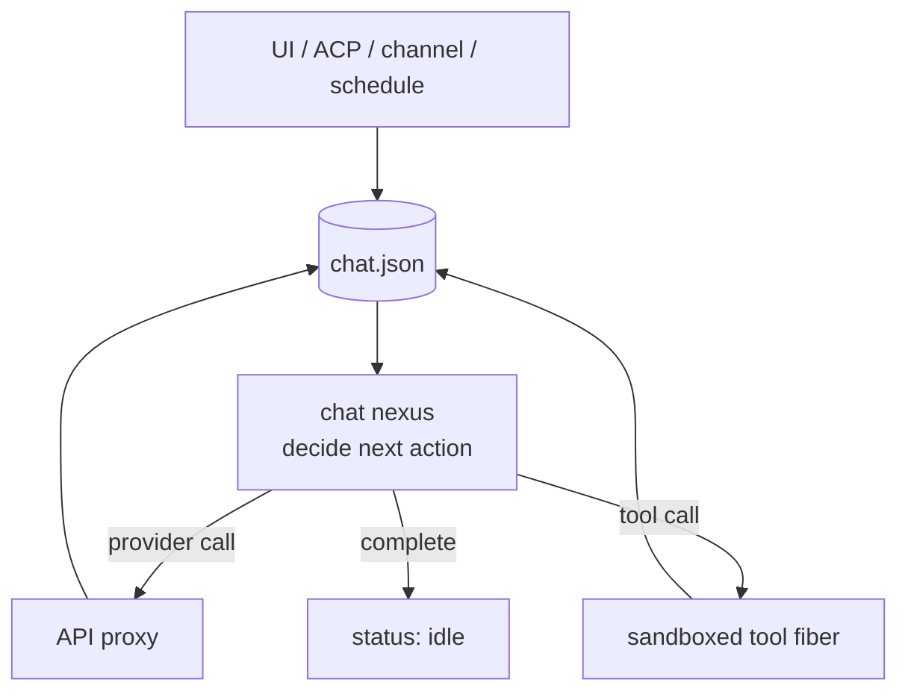

# Harness design

The harness is a deterministic, durable agent head with explicitly authorized
hands. Its state and process graph live in Grubbery; models, tools, channels,
and peers are effects reached through narrow interfaces.

## Deterministic head

The system of record is the tree below `/apps/harness.harness`. Each chat is a
grub with a complete transcript and a resumable event loop. Configuration,
context documents, child tasks, authored code, and assistant output are nearby
record grubs rather than fields hidden inside one Gall core.

An admitted message is written to the chat, the chat chooses its next action,
and a fiber requests the needed effect. Provider replies and tool results are
written back before the next action is chosen. An Arrow is transactional: a
failed invocation annuls that invocation's state and effects, while completed
work remains committed.

The parent nexus supervises the tree. A process failure produces a visible
`bang` at the failing grub instead of partially mutating an unrelated sibling.
Restarting a fiber resumes from durable state.

## Context and memory

The transcript is retained in full. Provider requests receive a token-bounded
window assembled from the current conversation, system policy, context files,
and tool definitions. `grep_history`, `recall_messages`, and targeted
`summarize` let the model recover older material without treating deletion as
memory management.

Stable instructions should remain at the front of provider requests so prompt
caches can be reused. Dynamic recalls, tool results, and the newest messages
belong later. Provider-native tool-call structure is preserved across turns;
the harness extracts only what it needs for routing and inspection.

Context documents are ordinary files. This makes policy, memories, skills, and
reference material reviewable and addressable. Generated indexes and summaries
are caches beside those records and must be rebuildable.

## Effects and authority

Fibers yield typed Darts for work outside the deterministic head: HTTP, Clay,
timers, Gall, notifications, provider calls, and ports. Roads name resources.
Weirs restrict the roads a process may reach.

An installed tool is therefore both code and a capability decision. Agent
authorship writes source under `/apps/code`; compilation makes that source
executable, but it does not automatically broaden its weir. Promotion to a
shared or stronger capability requires tests, evidence, and an explicit grant.

Provider secrets stay in API proxy nexuses. Channels receive narrow inbox/send
contracts. ACP does not grant ambient terminal or host-filesystem access.

## Payloads and content addressing

Large images, archives, model-native traces, and tool output should not be
copied through chat history. They belong in addressed payload grubs or a
content-addressed store, with stable references in the transcript.

The transcript retains the semantic event and its payload reference. Storage
policy may later move bytes between loom, Clay, and blob facilities without
changing chat ownership or provider semantics. Retention and garbage
collection must follow reachability and fork provenance, not arbitrary age.

## Subagents and assistants

A child agent is a supervised directory with its own context, budget, tools,
status, and durable output. Joined work returns its result to the calling chat;
detached work exposes a handle that can be inspected or awaited. Cancellation
travels to the child instead of leaving an invisible task behind.

Assistants are scheduled programs with durable configuration and outputs.
They use the same provider and tool boundaries as interactive chats. Missed
schedules, sleep, restart, and notification behavior are explicit process
policy rather than special cases in the main agent loop.

## Client and application surfaces

Different transports project one process tree:

- The React UI uses authenticated ball reads, subscriptions, and pokes.
- ACP maps editor sessions to durable chats and replays those chats on load.
- `%grub-client` gives on-ship Gall applications a thin conventional surface.
- Channels translate an external messaging identity into narrow input/output.
- Typed `/port` endpoints preserve source-ship identity for remote work.

No transport owns a second transcript or run queue. A client can disconnect,
be replaced, or use another surface without changing the agent's durable head.

## Forks and provenance

A chat fork should record its parent and divergence point, then share immutable
history structurally. Child-agent lineage, payload references, authored-code
revisions, and promotion evidence should use the same provenance vocabulary.
Deleting a record must respect descendants that still reference it.

## Operational contract

A distribution build pins the complete Grubbery source, applies the small
harness overlay, builds the React assets, and installs from a Clay desk named
`%grubbery`. Ship-side commits are part of validation: Ford compiles the Hoon,
Gall boots the declared agents, HTTP exercises the real bindings, and the
process tree is inspected for `bang`s.

The roadmap in [`roadmap.md`](roadmap.md) tracks which parts of this design are
present and which remain deliberate work.
